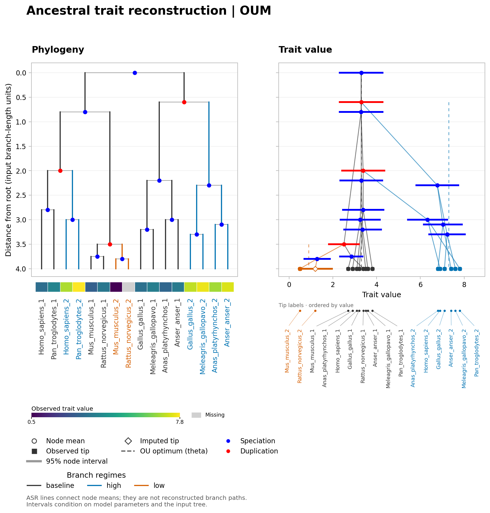
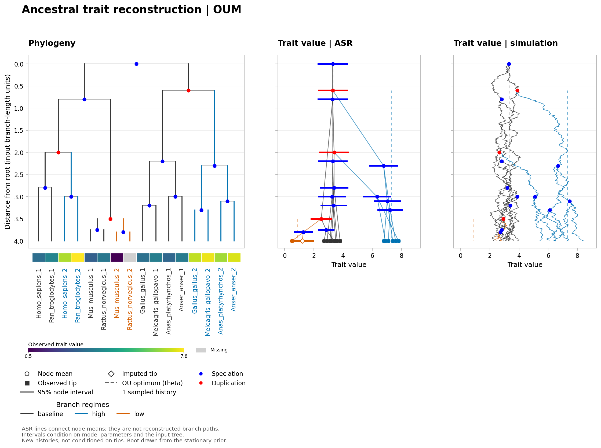

# Ancestral trait reconstruction

`nwkit asr` reconstructs traits at every node and imputes missing tip values.
Discrete inference includes ER, SYM, ARD, F81, GTR, fitted rate-class designs,
Pagel independent/dependent binary-trait models, fixed-generator CUSTOM,
branch-regime Mk, hidden/covarion rates, across-character rate mixtures, and a
Bayesian threshold/liability model. Continuous inference includes BM,
Pagel lambda/kappa/delta transforms, EB/ACDC, directional and regime drift,
multivariate BM/shared-OU/diagonal-attraction OU, flexible-root OU, and
OUM/OUMA/OUMV/OUMVA regime models.
The tree must be rooted under the
[shared rootedness contract](CLI_TSV_CONVENTIONS.md#rootedness-and-root-polytomies).
Root and internal polytomies, non-ultrametric trees, and finite non-negative
non-root branch lengths are supported. Root stem length is not part of any
model. No rerooting, arbitrary binary resolution, or automatic trait
transformation is performed.

## Visualizing continuous ancestral traits

Add `--figure-out asr.pdf` to a continuous `nwkit asr` command to draw a
phylogeny beside ancestral trait estimates on a shared vertical depth axis.
PDF, SVG, and PNG are supported. Each trait in a multivariate model gets its own
panel and value scale. Tip labels are vertical (90 degrees), and trait labels
use the selected column names. The figure always includes every node, independently of
the TSV `--target` selection. Discrete models currently reject `--figure-out`;
their annotated trees can be visualized with `nwkit draw`.

Open or event-colored circles show node means, horizontal bars show the marginal intervals
selected by `--ci-level` (default 95%), filled squares show observed tip values,
and open diamonds mark missing tip values reconstructed by the model. With
measurement error, the observed square can differ from the inferred latent tip
mean; bars describe the latent trait, not measurement error. Branch regimes use
matching colors in the tree and trait panels. OU optima (`theta`) are dashed
references, distinct from ancestral values. Regime reference lines span the
depth range of branches assigned to that regime; they do not locate additional
shift events or imply that the regime occupies every intervening branch.

In the ASR panels, connecting segments **only join node means**. They are not inferred branch
trajectories, and no branch-interior uncertainty band is implied. Intervals
condition on the fitted/fixed parameters and the input tree, even when bootstrap
diagnostics are requested separately. Branch depths use the original input
lengths, including for transformed models, and exclude the root stem. The axis
is not automatically converted to geological time. Non-ultrametric trees, root
polytomies, and zero-length branches retain their actual geometry.

Use `--figure-width` and `--figure-height` to set dimensions in inches. The
default width follows the number of tips and traits; the default height is at
least 7.5 inches, expanded to accommodate long tip labels and simulation notes.
Dense trees or coincident node values can still overlap; larger dimensions
help with labels, while individual coincident values remain available in the TSV.
Figure output cannot alias the input or another output. Figure replacement is
recoverable on a handled rendering failure; ASR's full set of outputs is not one
transaction.

A complete [synthetic OUM example](examples/asr_figure/README.md) is included:



### Observed tip heatmap

Add `--figure-tip-heatmap yes` to show observed trait values as a heatmap below
the phylogeny (`no` is the default). Each cell is aligned to its tip label;
labels share a common baseline even for non-ultrametric trees, while branch
lengths and the depth axis remain unchanged. Purple marks the low end of each
trait's observed range and yellow the high end; gray means missing. ASR-imputed
values are not substituted into this observed-data heatmap.

Each trait has its own numeric color key. With multiple traits, numbered rows
match the numbered keys. `asrcompare --figure-layout panels` uses the same
observations and per-trait ranges for every model, so its heatmaps are directly
comparable. The strip displays the observed trait (or the effective weighted
observation when using replicate inputs), not the latent tip mean. Measurement
uncertainty remains in the ASR panel. Heatmaps only affect figures and require
`--figure-out`; comparison figures additionally require panel layout.

### Speciation and duplication circles

`asr` and `asrcompare --figure-layout panels` accept the same species parser
controls as `draw`: `--species-parser`, `--species-regex`, and
`--species-map-tsv`. With `--species-overlap-node-plot auto` (default), all tip
labels must be parseable before event colors are enabled. For example,
`Homo_sapiens_1` and `Homo_sapiens_2` both identify species `Homo_sapiens` under
the default parser. An overlap in species between child clades labels a branching
node as duplication (red); disjoint child species sets label it as speciation
(blue), using exactly the same heuristic and colors as `draw`.

Event circles appear at the corresponding nodes in the phylogeny, ASR, and
simulated-history panels. ASR interval bars match their node circle colors.
Branch colors and OU reference lines continue to
indicate supplied regimes. `--species-overlap-node-plot no` disables event
colors. `yes` classifies fully parsed subtrees even if other labels are missing
or unparseable; nodes depending on unparseable species remain unclassified.
These events are inferred from tip labels and topology, not trait values or
simulated paths, and do not discover regime shifts.

Simulation circles always mark the root and every original branching node,
including with event colors disabled. Each circle uses that history's sampled
node value; it is shared by incoming and daughter paths. Grid points and terminal
tips are not marked as branching events. Coincident sampled node values can
overlap, particularly with error-free conditioning or zero branch lengths.

### Simulated evolution along branches

Add `--figure-simulations 1 --seed 7` to include a finite-grid history beside each
ASR panel. The panels share the same depth axis, trait-value limits, branch colors,
and OU-optimum references. Each history is one joint realization on the whole
tree: daughters start from the same sampled parent value and then evolve
independently conditional on that value. Larger counts overlay independent
histories. `--seed` makes the paths reproducible, and enabling the panels does not
change the ASR fit, output table, or other simulation diagnostics.

```sh
nwkit asr -i tree.nwk --input-rooted yes \
  --trait traits.tsv --state-column "Trait value" --model OU \
  --figure-out asr.pdf --figure-simulations 1 --seed 7 -o asr.tsv
```

Two modes are available:

- `--figure-simulation-mode unconditional` (default) generates new latent
  histories using the fitted/fixed parameters. These are not conditioned on
  observed tips and are not estimates of the actual historical trajectory.
  Proper OU roots follow the selected stationary, Gaussian, or fixed root prior.
  An improper flat root cannot be sampled, so BM-family histories start at the
  inferred root mean; this choice is stated in the figure.
- `--figure-simulation-mode conditional` draws joint posterior histories
  conditioned on the observed tips. Error-free observed tips are pinned to their
  values; noisy tips represent inferred latent values, and missing tips remain
  uncertain. The conditioning uses the same measurement errors as ASR. Parameter
  and tree uncertainty are not included in either mode.

Paths use exact Gaussian transition draws on a subdivided copy of the tree,
not an Euler approximation or cosmetic noise added to node means. The original
tree is unchanged. `--figure-simulation-steps 200` is the default number of steps
on the longest branch; shorter branches receive proportional counts, with at
least one step. Lines interpolate the displayed grid points, not every intervening
fluctuation. Zero-length branches preserve their parent value. Finer grids change
the displayed paths but not the model's theoretical endpoint distribution.

Supported models are BM, BM-DRIFT, BMS, BMS-DRIFT, OU, OUM, OUMA, OUMV, OUMVA,
MV-BM, MV-OU, MV-OU-DIAG, and MV-OU-FULL. Multivariate histories retain cross-trait covariance
and require a positive-definite fitted diffusion covariance. Path panels
currently reject LAMBDA, KAPPA, DELTA, EB, and ACDC: simply subdividing their input
branches and reapplying the transformation would not in general preserve the
original model. Their ASR node-summary figures remain available. Resource guards
limit the refined tree to 100,000 nodes, the samples to 2,000,000 trait values,
and the rendered branch traces (branches times histories) to 50,000.
Reduce history count or grid resolution if the guard is reached.



## Input and automatic type selection

The TSV requires `leaf_name` and the column selected by `--state-column`.
Multivariate Gaussian models instead accept two or more comma-separated columns, for example
`--state-column height,mass`.
Pagel discrete models require exactly two comma-separated binary-trait columns.
Tip names are matched exactly, including numeric-looking names and literal
names such as `NA`. Duplicate names or column headers are errors. The shared
`--missing-values` and `--unmatched warn|error|ignore` policies apply.

`--trait-type auto` is the default:

- Only non-missing values at tips present in the input tree are considered.
- If all considered values parse as numbers, the trait is continuous. Non-finite
  numbers such as `inf` or overflowing exponents are errors, not categorical
  fallbacks. Recognized missing markers are removed before detection.
- Otherwise the trait is discrete. For example, `red`, `blue`, or the ambiguous
  value `0|1` select the discrete mode. A mixed numeric/text column is also
  discrete unless a token parses as a non-finite number, which is an error;
  select explicit discrete mode to retain such a literal category, or explicit
  continuous mode when unexpected text should fail.
- An all-missing column cannot be classified. Explicit discrete mode with
  `--states` can perform a prior-only analysis only with a fully fixed process:
  ER plus `--rate`, or CUSTOM plus `--rate-matrix`. Fitted ER, SYM, ARD, F81,
  GTR, MK-REGIME, and HRM parameters have no likelihood information and are
  rejected. COVARION, MK-MIXTURE, THRESHOLD, and fitted continuous models are
  also rejected without informative observations. Continuous mode requires at
  least one observed value even when the rate is fixed.

Override with `--trait-type discrete` or `--trait-type continuous`. In particular,
numeric category codes such as `0,1,2` **require explicit discrete mode**.
Category spelling is preserved: `001`, `01`, and `1` remain different discrete
states. Supplying `--states`, `--model ER`, or another discrete-only option does
not override numeric detection; incompatible combinations fail with guidance.
Discrete ASR requires a model state space containing at least two states. If an
invariant sample observes only one category, provide the biologically valid
larger state space explicitly with `--states`; a one-state CTMC has no estimable
transition process and is rejected consistently by every discrete model.
The selected/requested types are reported on STDERR and in `--model-out`.
Automatic continuous selection also prints a reminder that numeric category
codes require explicit discrete mode.

| Option | Discrete | Continuous |
|---|---|---|
| `--model` | ER (default), SYM, ARD, F81, GTR, MK-DESIGN, PAGEL-INDEPENDENT/DEPENDENT, MK-REGIME, HRM, COVARION, MK-MIXTURE, THRESHOLD, CUSTOM | BM (default), BMS, BMS-DRIFT, LAMBDA, KAPPA, DELTA, EB, ACDC, BM-DRIFT, MV-BM, MV-OU, MV-OU-DIAG, MV-OU-FULL, OU, OUM/OUMA/OUMV/OUMVA, JUMP-BM, MM-BM, MM-OU, BRANCH-GAUSSIAN |
| `--root-prior` | equal/empirical/stationary for CTMCs; identified Gaussian for THRESHOLD | flat for BM-family models; stationary for OU-family models; OU also supports fixed or Gaussian; BRANCH-GAUSSIAN requires an explicit fixed/flat/gaussian/stationary prior |
| `--output` | probabilities (default), map | summary (default); BRANCH-GAUSSIAN also supports likelihood and prior-samples |
| `--tree-annotation` | map (default), state, probability, all | summary (default), mean, all |
| Rate controls | `--rate`, `--rate-bounds`, `--rate-design`, `--rate-matrix`; mixture/covarion controls | `--sigma2`, transform parameters, `--alpha`, `--alpha-by-trait`, `--theta`, and `--drift` as applicable |
| Structure controls | states/graph/design/regime/hidden controls; multiple columns for MK-MIXTURE or Pagel | fixed or latent regime controls; direct/regime branch-model TSVs for BRANCH-GAUSSIAN; multiple trait and SE columns for MV models |
| Observation uncertainty | Ambiguous states; THRESHOLD MCMC | Known per-trait measurement SEs for every continuous model |
| Interval/parameter uncertainty | THRESHOLD posterior probabilities and liability moments | Conditional Gaussian intervals; optional transform profile CI, joint posterior samples, PPC, and bootstrap |
| Simulation | CTMC stochastic maps except MK-MIXTURE/THRESHOLD | `--posterior-samples-out`, `--posterior-predictive-out`, `--bootstrap-out`, and `--seed` |

Model/output/prior defaults are selected after trait detection. The continuous
root prior describes uncertainty about a numeric root value; it is independent
of `--input-rooted`, which describes the interpretation of the tree.

## Discrete Mk models and transition structure

ER shares one rate across all allowed directed transitions, SYM fits one rate
per allowed unordered pair, and ARD fits every allowed directed rate separately.
The default `--transition-graph complete` reproduces the original complete Mk
models. `--transition-graph ordered` requires an explicit `--states` order and
allows only bidirectional transitions between adjacent states. A path instead
reads a directed TSV edge list:

```tsv
from_state	to_state
juvenile	adult
adult	senescent
```

This supports irreversible ARD models by listing only forward edges. SYM
requires a symmetric edge set. For ER, `--rate` fixes the shared rate; for SYM
and ARD it remains the common optimizer starting value. All fitted rates use
`--rate-bounds`. Fitted models use deterministic homogeneous, patterned, and
coordinate multistarts, retain the best converged likelihood, and report start
counts, failures, and lower/upper-bound rates in `--model-out`.
Structured models are rejected before optimization when they would require more
than 256 free transition parameters; the same total-parameter guard applies to
MK-REGIME and the base generator of MK-MIXTURE. ER transition probabilities use
a cancellation-safe formula, so positive rates remain positive even far below
the precision at which `exp(-x)` can be distinguished from one.

F81 and GTR require the complete transition graph. F81 uses target-specific
rates `q_ij = r_j`; equivalently, its equilibrium frequencies are
`pi_j = r_j / sum(r)` and its overall scale is `sum(r)`. GTR uses symmetric
pair exchangeabilities `s_ij` and fitted equilibrium-frequency ratios, with
`q_ij = s_ij * pi_j`. The first frequency weight is fixed to one to remove the
otherwise redundant frequency scale. Exchangeabilities use `--rate-bounds`;
frequency ratios use fixed numerical bounds reported in `--model-out`. F81 and
GTR default to a stationary root prior, while equal and empirical priors remain
selectable.

`--model MK-DESIGN --rate-design design.tsv` fits an arbitrary partition of
direct transition rates. The TSV must contain exactly these columns in order:

```tsv
from_state	to_state	rate_class
juvenile	adult	forward
adult	senescent	forward
senescent	adult	reverse
adult	juvenile	reverse
```

Only listed directed edges are allowed, and every edge sharing a `rate_class`
uses one fitted rate. State names must belong to the inferred or explicit model
state space; self edges, duplicate edges, empty classes, and an empty design are
rejected. The design therefore expresses ordered, irreversible, symmetric, or
other biologically motivated rate-sharing hypotheses without supplying fixed
rate values. `--rate` is a common optimizer starting value, while
`--rate-bounds` constrains every class. A separate `--transition-graph` is
invalid because the design already specifies both edges and sharing. Model
metadata reports the design path, class order, fitted class rates, and full Q.

`PAGEL-INDEPENDENT` and `PAGEL-DEPENDENT` model the correlated evolution of two
binary traits supplied as `--state-column trait1,trait2`. The four joint states
form one CTMC in which exactly one trait may change per instantaneous event;
simultaneous two-trait jumps are excluded. The independent model has four rates
(two directions for each trait, shared across the other trait's background).
The dependent model has eight rates because each direction may depend on the
other trait's state. Each column must resolve to exactly two model states. To
include an unobserved state or fix ordering, use
`--states 'A0,A1;B0,B1'`. If one tip trait is missing, its two compatible joint
states remain in that tip's likelihood, so information from the observed trait
is retained. Standard output, tree annotations, and stochastic maps use four
unambiguous JSON-encoded joint-state labels. The two Pagel models share
`likelihood_kind=pagel_joint_ml` and can be compared to each other; this
joint-tip likelihood is kept separate from the across-character MK-MIXTURE
likelihood.

`--model CUSTOM --rate-matrix Q.tsv` uses a fixed labelled generator instead:

```tsv
state	x	y
x	0	0.2
y	0.4	0
```

The `state` rows must exactly match the state columns in order. State order is
inferred from this matrix unless `--states` is supplied, in which case it must
match exactly. Off-diagonal entries must be finite and non-negative. If every
diagonal is zero, nwkit derives each diagonal as the negative off-diagonal row
sum; otherwise the supplied diagonals must already satisfy that generator
constraint. CUSTOM does not fit or rescale Q.
Generator residual tolerances scale with each Q row, so a malformed very small
Q is not accepted merely because its absolute entries are small. Matrix
exponentiation repairs only roundoff-sized probability errors. Long branches
are exponentiated at a moderate time scale and repeatedly squared with
stochastic-row validation, avoiding generic `expm` row-sum drift while
retaining slow modes. Material negative entries or invalid row sums fail
explicitly.

### Branch regimes and hidden rates

#### Find branch IDs before assigning regimes

Use `nwkit nwk2table` on the **same input tree** you will pass to ASR:

```sh
nwkit nwk2table -i tree.nwk --input-rooted yes -o branches.tsv
```

The table includes `branch_id`, `parent`, `name`, and `dist`. Root 0 has parent
`-1`; every other ID identifies the branch entering that node from its parent.
IDs follow level-order traversal of the input tree, including unnamed internal
nodes. No preliminary ASR fit is needed.

To see those same IDs on a tree, use the computed `branch_id` label property:

```sh
nwkit draw -i tree.nwk --input-rooted yes -o branch-ids.svg \
  --node-label-property branch_id --node-label-target all \
  --node-label-prefix 'ID=' --support-labels no \
  --species-overlap-node-plot no --figure-width 6 --figure-height 2.5
```

PDF and PNG destinations work as well. IDs are displayed as integers. The `all`
target includes root and tips; the default label target is only internal nodes.
Drawing computes IDs before `--ladderize` and `--max-visible-tips`, so these
display operations preserve the original mapping. A collapsed clade shows its
original clade-root ID, not the IDs of hidden descendants; use the uncollapsed
tree to prepare a complete regime map. Selecting `branch_id` recomputes IDs from
the input tree even if NHX already contains a property with that name.

For example, `((A:1,B:1):1,C:2);` has root 0, the A/B internal node 1, C 2,
A 3, and B 4. Assigning the entire A/B clade to `high` gives:

```tsv
branch_id	regime
0	baseline
1	high
2	baseline
3	high
4	high
```

Save **only these two columns** as `regimes.tsv` and pass
`--regime-map regimes.tsv` with a regime model such as OUM or MK-REGIME. Every
ID, including root 0, must occur exactly once. Assignments are per incoming
branch and do not automatically propagate to descendants. The map specifies
the regimes; ASR does not search for their locations.
The [`nwkit shift`](SHIFT.md) command generates this map using calibrated
small-tree selection by default, or the explicit legacy kfl1ou backend. Passing
it to ASR performs a new fit. Calibrated contrast densities cannot be compared
directly with ASR full-data likelihoods; ASR does not inherit alpha-limit models
or selection uncertainty.

Rerooting, pruning, or reordering the actual input tree can change IDs. If the
input changes, regenerate both the ID table/figure and the regime map. Use the
same input format and rootedness interpretation in all commands.

#### Discrete branch regimes

`--model MK-REGIME --regime-map regimes.tsv` jointly fits one Q matrix per
named branch regime. `--regime-model ER|SYM|ARD|F81|GTR` selects the structure
shared by those independently parameterized matrices (default ER). The map must
assign every `branch_id`, including root 0, exactly once:

```tsv
branch_id	regime
0	background
1	background
2	foreground
```

Branch IDs are the same deterministic IDs used in normal ASR output. Every
estimated regime must occur on a positive-length non-root branch whose
descendant subtree contains an informative observation. A regime confined to
zero-length branches or wholly missing subtrees has no likelihood information
and is rejected. The root assignment selects which regime Q defines a
stationary root prior; it has no stem branch. Marginal inference and stochastic
mapping use the Q assigned to each incoming branch.

`--model HRM --hidden-categories H` expands each observed state into `H` latent
rate classes. Observed-state changes occur within a class, hidden-class changes
occur without changing the observed state, and every allowed expanded transition
gets its own ARD rate. Tip likelihoods sum over hidden classes; normal output and
stochastic maps are projected back to observed states, so hidden-only changes do
not appear as observed transitions. The expanded fit is subject to hidden-class
label switching and can be parameter-rich; nwkit rejects configurations requiring
more than 256 free rates or 64 expanded states.

`--model COVARION` uses the same expanded state space with an identifiable,
parsimonious parameterization: ordered log-spaced hidden rate multipliers have
geometric mean one, observed-state changes share a base rate, and hidden classes
switch at one fitted rate. This removes arbitrary class-label and scale
confounding. Every effective hidden-class observed-transition rate is constrained
to `--rate-bounds`; a fixed `--rate` must lie strictly inside those bounds so the
spread remains identifiable. Model metadata reports both multipliers and effective
rates, and boundary-saturated fits are excluded from regular AIC/AICc/BIC ranking.
Standard output marginalizes hidden classes and stochastic maps project away
hidden-only changes.
To bound dense matrix-exponential cost, observed states times hidden classes may
not exceed 64 expanded states in either hidden model; the HRM 256-rate guard is
likewise evaluated before allocating its expanded transition graph.

`--model MK-MIXTURE --state-column c1,c2,...` jointly fits at least two
characters under one ER/SYM/ARD/F81/GTR base generator. `--rate-mixture gamma`
(default) estimates a mean-one discrete-gamma shape using equal-probability
bins represented by their conditional means; `free` estimates ordered mean-one
category rates and weights. `--rate-categories` accepts 2 through 8.
Each character gets its own posterior rate-category probabilities before node
states are averaged over categories. Primary output is stacked by `trait`.
Because the mixture is across characters rather than along branches, a single
branchwise stochastic map is undefined and rejected. Transition matrices are
computed once per category/unique branch length and reused across characters.

`--model THRESHOLD --states low,medium,high` treats the ordered categories as
intervals of a latent Brownian liability. Scale and location are not jointly
identifiable from categories, so the process is fixed to unit diffusion with
`X_root ~ Normal(0,1)`. Binary data use threshold zero. Ordinal data fix the
first threshold at zero and sample the remaining ordered thresholds; all states
must then be observed. `--thresholds` instead fixes every threshold. Data-
augmentation MCMC samples all node liabilities, with retained draws, burn-in,
thinning and chains controlled by `--liability-samples`,
`--liability-burnin`, `--liability-thin`, and `--liability-chains`.
Ambiguous ordered observations constrain liabilities to the union of their
allowed category intervals and remain valid as estimated thresholds move.
`--liability-out` reports posterior liability moments. Optional
`--liability-diagnostics-out diagnostics.tsv` reports one row per node liability,
node second moment, node/category indicator, and threshold. All nodes are
monitored, including internal ancestors and missing or ambiguous tips, regardless
of the primary output target selection. `--model-out` reports the aggregate
status and diagnostics. See [THRESHOLD_DIAGNOSTICS.md](THRESHOLD_DIAGNOSTICS.md)
for definitions, prior assumptions, numerical validation, and storage costs.

Diagnostic version `rank_split_v1` uses rank-normalized split/folded R-hat and
multi-lag bulk/tail ESS. The retained columns `mcmc_rhat_max` and `mcmc_ess_min`
have these new definitions; ESS is no longer a lag-one AR(1) approximation.
The default checks are R-hat <= 1.01 and bulk/tail ESS >= 400. Category
probabilities additionally require indicator mean ESS >= 400 and absolute
Monte Carlo standard error <= 0.01. These are computational checks, not a
proof that the model describes the data or that every posterior region was
visited. Small/rare category probabilities need additional relative precision.

Fixed thresholds and observation-determined categories are marked
`structural_constant` and excluded. An unknown quantity that remains constant,
an unvisited nonstructural category, non-finite draws, fewer than two independent
chains, or fewer than eight retained draws per chain cannot pass the checks.
An unavailable diagnostic is not silently omitted when determining `fit_status`.
Finite aggregate extrema summarize available diagnostics only; inspect the status
and unavailable count as well. Failing diagnostics retain the requested output
and emit the status to stderr, allowing inspection and a longer independent run.
Burn-in may be zero. Four independently seeded, dispersed feasible initial
states remain the default; thinning remains one and is not a mixing remedy.
Threshold inference requires positive branch lengths and does not report a
marginal likelihood or support CTMC stochastic mapping.

`--root-prior stationary` derives root frequencies from the current Q, including
inside each fitted-rate likelihood evaluation. It requires a unique valid
stationary distribution; reducible generators with multiple stationary
distributions fail explicitly. Equal and empirical root priors remain available.
Marginal reconstruction, missing-tip imputation, zero-length branches,
polytomies, and stochastic transition-count mapping all use the selected graph
or fixed Q without binary tree resolution.

Uniformization chooses a Poisson cutoff with omitted mass at most `1e-12`
times the smallest positive branch transition probability, accounting for rare
conditioned endpoints in both count-only and full-history mapping.

Uniformization caches small branch calculations, but does not retain every dense
matrix power or every state-pair event-count distribution for high-rate branches.
It instead constructs the required endpoint-specific backward vectors. A single
branch requiring more than 2,000,000 potential events is rejected before a large
allocation, and one endpoint history is capped at 256 MiB after accounting for
the expanded state count; reduce the state/rate/time scale or fitted rate bounds
in that case. A requested simulation set is also rejected when its conservative
preparation-plus-sampling bound exceeds 2,000,000 uniformization steps; reduce
`--n-sim`, rates, or the rate/time scale instead of starting an unbounded job.

## Continuous BM model

For each branch of length `t`, `X_child | X_parent` is normally distributed
with mean `X_parent` and variance `sigma2 * t`. The root has a flat prior with
respect to trait units, and its value remains uncertain rather than being
estimated and then treated as known. All-node inference uses an upward Gaussian
integration pass and a downward smoothing pass, taking O(nodes) time and memory
per rate evaluation. Estimates at an internal node condition on **all** observed
tips, not only its descendants.

If a known SE `s` is supplied, the observation has distribution
`Y_tip | X_tip ~ Normal(X_tip, s^2)`. SEs must be finite and non-negative, and
every observed value needs an SE. Missing markers are matched against the
original SE text before numeric conversion, including custom numeric markers
such as `--missing-values 999`. Missing tips need no SE. Without an SE column,
observed tips are exact; their reconstructed values equal the observations and
their conditional variances are zero. With positive SEs, the output reconstructs
the latent trait and can differ from the observed value. Its interval is not
an interval for a new noisy measurement.

`--sigma2 FLOAT` fixes a non-negative variance rate. Otherwise the rate is fitted
by REML, integrating the latent internal states and the unknown root value.
Exact-data fits use a closed form. Known-SE likelihoods can have multiple local
maxima; their rate search uses likelihood bounds over the full feasible range,
including zero, to check competing maxima to numerical tolerance. Rate-independent
within-position measurement residuals are excluded from optimization but retained
in the reported likelihood. Branch lengths are used in their original
units: the rate has units of trait-squared per branch-length unit. Multiplying
all branch lengths by `c` and dividing a fixed rate by `c` preserves inference.
Multiplying trait values and SEs by `a` multiplies the fitted rate and conditional
variances by `a^2`. Numerical centering/scaling is undone before output; it does
not normalize the evolutionary covariance to unit tip variance.

Intervals are Gaussian, equal-tail, and conditional on the fixed/fitted rate and
input tree, with coverage controlled by `0 < --ci-level < 1`. They include root
uncertainty but **exclude rate-estimation and tree uncertainty**. Positive,
bounded, or transformed traits are not detected/transformed automatically;
the analyst must choose an appropriate scale before running BM.

### Exact constraints and boundary fits

- A zero-length edge identifies its endpoints as the same latent state. The
  original nodes remain in the output. Contradictory exact observations joined
  by zero-length edges are errors, including when a positive rate is fixed.
- Identical exact observations at one zero-edge position count once for fitting
  and likelihood dimension. Noisy measurements at that position remain separate
  observations and are combined with their known SEs.
- Rate estimation requires observations at at least two distinct positions
  separated by positive-length edges. Otherwise supply a fixed `--sigma2`.
- Identical exact data can give `sigma2=0` and zero-width plug-in intervals.
  This is a boundary estimate, not evidence that the evolutionary rate is known
  to be zero. A warning and `fit_status` make this explicit. If the best positive
  rate is likelihood-indistinguishable from zero at floating-point precision,
  the zero boundary is preferred and reported.
- With measurement error, a zero evolutionary rate can retain positive
  uncertainty in the common latent value. Different exact values are impossible
  under fixed `--sigma2 0`.
- Singular feasible zero-rate limits have `fit_status=singular_zero_boundary`
  and an empty `restricted_log_likelihood`. Regular zero-rate limits have
  `fit_status=zero_boundary`; interior fits use `ok`. No epsilon rate/branch
  is substituted, and optimizer failure is an error. Unresolvable input dynamic
  ranges or an exhausted global-search budget also fail explicitly; a numerical
  lower limit is never reported as a successful rate estimate.
- A fitted `sigma2_lower_boundary` or `root_variance_lower_boundary` denotes a
  nonregular zero-variance-component limit. Its numerical likelihood remains a
  diagnostic, but `asrcompare` and legacy IC comparison exclude it because the
  result depends on an artificial positive optimizer bound and regular-model
  AIC/AICc/BIC assumptions do not apply.

`fit_status` describes the numerical rate value and likelihood support, whether
the rate was fitted or fixed. Use `sigma2_estimated` or `estimation_method` to
distinguish those cases.

## Continuous OU model

`--model OU` implements a single-optimum process. Its default stationary root
distribution is:

```text
X_root ~ Normal(theta, sigma2 / (2 * alpha))
X_child | X_parent ~ Normal(
    theta + exp(-alpha * t) * (X_parent - theta),
    sigma2 * (1 - exp(-2 * alpha * t)) / (2 * alpha)
)
```

Here `alpha` is the attraction strength per branch-length unit, `theta` is the
trait optimum, and `sigma2` is the diffusion variance per branch-length unit.
Each parameter is fixed when its corresponding `--alpha`, `--theta`, or
`--sigma2` option is supplied and fitted by ordinary ML when omitted. Stationary
OU requires strictly positive alpha and sigma2. The default positive alpha
bounds are `1e-6 / max_root_to_tip_depth` through
`50 / max_root_to_tip_depth`; override them with `--alpha-bounds MIN,MAX`.
Theta is profiled exactly from its quadratic tree likelihood in one linear pass.
The remaining zero-, one-, or two-dimensional covariance likelihood is searched
on a deterministic log grid, including exact boundaries, and polished from
competing local/boundary starts. Boundary-adjacent grid intervals are polished
before a boundary is accepted. In two dimensions, Powell fallback is reserved
for cases where all primary starts fail or a failed endpoint remains competitive
with the best converged likelihood, avoiding expensive work in inferior basins.
The free stationary variance is optimized over a reported data-scaled range
spanning 24 orders of magnitude. Alpha or stationary-variance boundary solutions
are reported in `fit_status` rather than silently treated as interior optima.
Optimizer convergence/failure and grid/start counts are retained; a coarse-grid
fallback is explicitly marked rather than reported as `ok`.

The number of distinct observed tree positions must be at least the number of
free OU parameters. Replicate noisy observations at one zero-length-contracted
position remain separate likelihood observations, but do not create additional
phylogenetic positions for this identifiability check.

OU uses the same O(nodes)-time/O(nodes)-memory upward and downward Gaussian
passes as BM for each parameter evaluation. It supports rooted polytomies,
non-ultrametric trees, exact observations, known measurement SEs, missing tips,
and exact zero-length contraction. Reported Gaussian intervals condition on the
fixed/fitted alpha, theta, sigma2, and tree; parameter and tree uncertainty are
not integrated. Unlike BM's flat-root REML quantity, OU reports an ordinary ML
log likelihood under its finite stationary root prior. The two likelihoods
therefore do not share an interchangeable AIC convention.
Fitting requires many such linear passes for grid evaluation and local polishing;
fixing alpha, theta, or sigma2 reduces that work, and fixing all three requires
only the final pruning/smoothing passes.

`--root-prior fixed --root-mean M` instead fixes the root state. A proper
nonstationary prior is selected with
`--root-prior gaussian --root-mean M --root-variance V`. These modes fit alpha,
sigma2 and theta by ordinary proper-root ML through the shared affine-Gaussian
engine; the user-supplied root variance is not multiplied by sigma2.
Stationary-root OU rejects root mean/variance options. The biological root
assumption is therefore explicit rather than silently forcing equilibrium at
the beginning of a short or nonstationary tree.
Before optimization, free proper-root OU parameters are checked for local rank
through their induced observed-tip mean vector and covariance matrix. For
example, free alpha and sigma2 on an equal-depth fixed-root star are rejected
because only one variance combination is identified.

## Continuous model extensions

All scalar extensions retain the Gaussian all-node smoothing and conditional
interval contract described above. Known per-tip measurement SEs are supported
by every scalar model; all multivariate models accept one comma-separated SE
column per trait and allow trait-level missingness.

### BMS: branch-regime Brownian rates

`--model BMS --regime-map regimes.tsv` uses variance
`sigma2_regime * t` on each incoming branch. The regime-map schema and root-row
requirement are the same as for MK-REGIME; the root regime is recorded but has
no stem variance. `--sigma2` fixes one shared rate. To fix different rates, use
a complete parameter table:

```tsv
regime	sigma2
background	0.2
foreground	1.5
```

Without either fixed-rate input, all regime rates are estimated jointly by
restricted likelihood. There must be at least one more distinct observed tree
position than fitted regimes, and the regime-specific covariance components
must be linearly distinguishable after removing the flat root. Deterministic
positive multistarts, data-scaled bounds, convergence counts, and boundary
status are reported. A fixed regime
rate may be exactly zero; estimated zero-boundary mixtures are not currently
profiled, so a lower-bound result is explicitly retained as a boundary fit.
Model-induced exact equalities from fixed zero rates retain an explicit singular
support status and do not report a density on a reduced observation space.

### BMS-DRIFT: regime rates and directional trends

`--model BMS-DRIFT` uses
`X_child = X_parent + drift_regime*t + error` with
`Var(error)=sigma2_regime*t`. A complete `--regime-parameters` table has
`regime`, `sigma2`, and `drift` columns. Without it, `--sigma2` or `--drift`
can fix one shared component while the other component is estimated per regime;
omitting both estimates both maps. Before optimization, nwkit verifies full rank
of the root-to-tip regime-time design for drift and the pairwise path-regime
design for diffusion. This catches ultrametric/global-drift and unrepresented-
regime confounding explicitly. The model uses the same flat-root integrated
likelihood convention as BM/BMS.

### OUM/OUMA/OUMV/OUMVA: branch-regime OU

OUM shares one positive `alpha` and one positive `sigma2`, but assigns an optimum
`theta_regime` to each branch. The transition on a branch uses its incoming-branch
regime; the stationary root distribution is centered on the root regime's
theta. `--theta` fixes one shared optimum, while a complete table fixes different
optima:

```tsv
regime	theta
cold	-1.0
warm	2.5
```

When omitted, all regime optima are estimated with alpha and sigma2 unless those
parameters are fixed separately. OUM uses ordinary stationary-root ML,
deterministic covariance multistarts, and explicit alpha/diffusion bounds.
The number of observed tips must exceed the total number of free parameters;
non-identifiable regime designs should instead use fixed parameters.
The related models vary additional branch parameters while retaining a
stationary root under the root regime:

- OUM: theta varies; alpha and sigma2 are shared.
- OUMA: theta and alpha vary; sigma2 is shared.
- OUMV: theta and sigma2 vary; alpha is shared.
- OUMVA: theta, alpha, and sigma2 all vary.

The complete parameter table therefore uses `theta`; `theta,alpha`;
`theta,sigma2`; or `theta,alpha,sigma2`, respectively. A shared CLI parameter
may be fixed only when its regime-specific counterpart is not in that table.
Multi-regime fits use the same generic affine-Gaussian pruning/smoothing engine,
positive parameterization, deterministic multistarts, and boundary reporting.
With exactly one mapped regime, every OUM-family variant is the same statistical
model as ordinary stationary OU, so nwkit instead delegates to the canonical OU fitter.
This gives exactly identical parameters, likelihood, status, and marginals while
avoiding a second generic optimization.
Each free non-root regime parameter must affect a positive-length branch
ancestral to an observation. In OUMVA, a regime appearing only at the root
cannot have both alpha and sigma2 free because only their stationary-variance
ratio is identified.

### LAMBDA, KAPPA, DELTA, EB/ACDC, and BM-DRIFT

The transformed-time Brownian models use one shared implementation and profile
their shape parameter jointly with sigma2:

- LAMBDA applies Pagel's lambda in `[0,1]` to shared/internal covariance while
  preserving each tip variance.
- KAPPA replaces every positive branch length `t` by `t^kappa`
  (`kappa >= 0`); zero-length contractions remain zero, including at kappa 0.
- DELTA transforms ultrametric node depth to
  `height * (depth/height)^delta` (`delta > 0`) and rejects non-ultrametric trees.
- EB and ACDC let diffusion change exponentially with root depth. EB is
  constrained to non-positive early-burst change; ACDC permits either decline
  or acceleration.

For EB/ACDC, a branch from depth `d` to `d+t` has effective Brownian length

```text
exp(eb_rate * d) * expm1(eb_rate * t) / eb_rate
```

with the continuous limit `t` at zero. `--evolution-parameter` and
`--evolution-parameter-bounds` are the common controls; `--eb-rate` and
`--eb-rate-bounds` remain aliases for EB/ACDC. A flat profile, such as an
equal-depth star where shape and sigma2 are confounded, is rejected; bound
optima are reported against the active user-supplied bounds. `--profile-ci-level`
optionally inverts the one-parameter
likelihood-ratio profile and records bounds plus boundary-limited flags in
`--model-out`.

BM-DRIFT uses transition mean `X_parent + drift * t` and Brownian variance
`sigma2 * t`. `--drift` fixes the directional trend. A free trend is profiled
from observed tips at different root depths. The search expands geometrically
until the likelihood optimum is bracketed instead of imposing artificial drift
bounds, which is important with strongly unequal observation errors. Drift is
confounded with the unknown flat-prior root value on contemporaneous tips, so
ultrametric observations require a fixed drift. Both models reduce exactly to
BM when their extension parameter is zero. An exactly linear, error-free fitted
trend is retained as an explicit `sigma2=0`, `singular_zero_boundary` result
rather than a spurious tiny positive diffusion estimate.

A free drift is profiled *after* integrating the flat root; it is not integrated
as a second fixed effect. Consequently, its reported flat-root likelihood and
`residual_df` retain the `n_effective - 1` convention, rather than the
`n_effective - 2` convention of a two-fixed-effect REML analysis. Output records
this treatment explicitly, and intervals condition on the fitted drift.

### MV-BM, MV-OU, and MV-OU-DIAG: correlated continuous traits

`--model MV-BM --state-column trait1,trait2,...` models each branch increment as
`MultivariateNormal(0, Sigma * t)`. Complete exact vectors use the linear-time
contrast/smoothing path. Trait-level missingness or known errors automatically
select a dense observed-coordinate likelihood, with one comma-separated
`--standard-error-column` per trait. Every trait needs enough observations to
identify its mean/covariance. Above 1,000 observed coordinates, incomplete/noisy
MV-BM, MV-OU and MV-OU-DIAG automatically use vector Gaussian pruning, storing per-node trait
matrices instead of a dense observed-coordinate covariance. Small fits
retain the dense implementation because its optimized factorization can be
faster. Full known measurement-error covariance also selects vector pruning. Dense
reconstruction computes node cross-covariances one node at a time,
without allocating a nodes-by-observations matrix, and rejects estimated
posterior result storage above 256 MiB. Multivariate `asrcompare` fits share
observed geometry and skip ancestral reconstruction entirely. Complete
error-free MV-BM remains on the linear-time path and is not subject to the
dense-coordinate cap. Explicit
all-zero SE columns are normalized to the same exact-observation path. All three
multivariate models report sample size as the number of distinct observed phylogenetic
positions, independent of trait dimension or dense/fast implementation path.
Even an all-zero SE mapping is validated for complete tip coverage, vector
dimension, finite numeric values, and non-negativity before the fast path is
selected. Dense covariance rank is calculated in normalized trait coordinates,
so changing trait/SE units cannot turn a full-rank fit into a singular one.
Brownian fitting also normalizes tree time, and identifiability/rank checks are
invariant to a uniform change of branch-length units. Distances are accumulated
along ancestor paths instead of subtracting large root depths.
Consistent exact observations at one zero-length-contracted position count once;
conflicting values at that position have zero likelihood and are rejected. A
covariance component is also rejected explicitly when the observed trait/branch
overlap leaves it absent from every independent flat-root contrast.

The generic pruning path is substantially slower on the measured small/medium
fixtures; its purpose is to avoid dense-memory limits. See
[measurements and reproduction commands](ASR_PERFORMANCE.md) for the time/memory
tradeoff and an actual fit above 1,000 observed coordinates.

`--model MV-OU` fits a stationary separable process with one shared positive
alpha, a full stationary trait covariance `Sigma`, and one optimum per trait:
`Cov(X_i,X_j) = Sigma * exp(-alpha * patristic_distance(i,j))`. Its equivalent
diffusion covariance is `2*alpha*Sigma`. Alpha may be fixed; Sigma and optima are
estimated by proper stationary-root ML. MV-OU supports the same partial vectors
and diagonal known measurement errors as dense MV-BM. A free alpha is rejected
when every observed pair within each trait combination has only one constant
phylogenetic distance, because alpha can then be absorbed into `Sigma`.
For both multivariate OU variants, default alpha bounds are `1e-6/T,50/T`,
where `T` is half the largest observed-coordinate patristic distance (or 1 if
all observed positions coincide). A shared stem above the observed MRCA does
not change this scale. Explicit `--alpha-bounds` still override these defaults.

`--model MV-OU-DIAG` replaces the shared attraction rate by a positive rate for
each trait. With `A = diag(alpha_1,...,alpha_d)` and positive-definite diffusion
covariance `D`, its stationary covariance is
`C_ij = D_ij / (alpha_i + alpha_j)`. For nodes `p,q` with LCA depth `s`,
`Cov(X_p,i, X_q,j)` is
`exp[-alpha_i(depth_p-s)-alpha_j(depth_q-s)] * C_ij`. This permits traits to
lose ancestral signal at different speeds while retaining correlated process
noise. Omit alpha options to estimate all `d` rates, use `--alpha FLOAT` to fix
one shared rate, or use `--alpha-by-trait a1,a2,...` in state-column order to
fix distinct rates. These fixed forms are mutually exclusive and cannot be
combined with `--alpha-bounds`. Every freely estimated trait alpha requires at
least two observations at distinct phylogenetic positions. The optimizer
parameterizes `D` by its Cholesky factor, so invalid diffusion covariances are
not searched. With fixed shared alpha, MV-OU-DIAG is exactly MV-OU and
`asrcompare` retains the former as an equivalent row rather than assigning
duplicate IC weight.

Primary output is long-form with one row per node/trait. `--covariance-out`
writes each selected node's conditional covariance and correlation upper
triangle; `--model-out` records stationary Sigma, rank, optimizer diagnostics,
and alpha/theta for OU models. MV-OU-DIAG additionally records every trait alpha
and diffusion-covariance element. Intervals condition on fitted parameters and exclude parameter
and tree uncertainty. `--posterior-samples-out` supports joint multivariate
draws across both nodes and traits, including missing values and known diagonal
measurement errors. The long-form schema is identical to scalar samples, with
one row per sample/node/trait. Positive-definite fitted diffusion is required;
singular fits are rejected for simulation diagnostics. `--posterior-predictive-out`
also reports per-trait discrepancies and pairwise observed-tip covariances,
with `trait` and `other_trait` columns identifying the comparison. Missing
coordinates remain missing in every replicate; covariances require at least
two jointly observed tips. `--bootstrap-out` refits the vector model and writes
covariance/optimum/rate elements with zero-based trait indices (for example,
`sigma_0_1`), as well as failed-replicate records. Multivariate cross-validation
and bootstrap prediction-error intervals remain unsupported.

### Model comparison and simulation diagnostics

For single-character discrete CTMC models, `--tip-likelihoods likelihoods.tsv`
accepts `leaf_name` followed by one column per state in the exact `--states`
order. Values are finite probabilities `P(data|latent_state)` in `[0,1]`, with
at least one positive entry per row. A supplied row replaces that tip's exact
trait coding; omitted rows retain their original likelihoods. This is a data
likelihood, not an already-computed posterior over states. Specify `--states`
when the likelihoods include states absent from the trait table.

Alternatively, `--misclassification-matrix errors.tsv` accepts `state` followed
by the same ordered state columns. Rows index true states and columns index
observed labels; each row must sum to one. Ambiguous observed labels are
marginalized by summing their columns, and missing tips remain uninformative.
Both inputs describe known observation mechanisms, add no fitted parameters,
and are mutually exclusive. `asrcompare` applies the same observation model to
every compatible candidate. THRESHOLD, MK-MIXTURE and two-character Pagel models
do not accept these single-character inputs.

`nwkit asrcompare` is the batch model-selection interface corresponding to
`rootcompare`. It reads the tree and trait table once, resolves the trait type,
fits every applicable requested candidate, and writes one row per candidate:

```sh
nwkit asrcompare -i tree.nwk --trait traits.tsv \
  --state-column body_mass --models all \
  --exclude-models BM-DRIFT -o comparison.tsv \
  --figure-out comparison.pdf --criterion aic
```

For a single PDF page containing the tree, ASR, and simulated histories **for
each continuous model**, select `--figure-layout panels`:

```sh
nwkit asrcompare -i tree.nwk --input-rooted yes \
  --trait traits.tsv --state-column "Trait value" --models BM,OU \
  --figure-out model-panels.pdf --figure-layout panels \
  --figure-simulations 1 --seed 7 -o comparison.tsv
```

Every fitted candidate occupies one row, ordered by comparison set and criterion
rank. The figure reuses its fitted parameters and all-node posterior; no model is
refitted for plotting. Each trait gets an ASR panel and, when requested, a
simulation panel. Depth and per-trait value scales are shared across models.
Headers show the fit status, IC value, and compatible comparison set; ranks are
only meaningful within a set. The tree colors follow each model's supplied
regimes. Intervals are 95% node marginals conditional on the fitted parameters.

Use `--figure-simulation-mode conditional` for posterior histories conditioned on
tips; the default is new unconditional histories. Simulation seeds are stable
per model identity, independent of row ordering or excluding other candidates.
Transformed models still receive ASR panels but explicitly mark branch simulation
as unavailable. Equivalent aliases, skipped candidates, and failed automatic fits
remain as labeled rows with their reasons; equivalent aliases are not refitted.

`--figure-width` and `--figure-height` set the entire page size in inches.
Defaults expand with the number of models, traits, and tip labels; the result is
one custom-size page, not necessarily A4. `--figure-simulations 0` (default) omits
simulation panels. The existing comparison table remains the default
`--figure-layout table`, including for discrete traits. Panel dimensions and
simulation controls require `--figure-layout panels`; the latter requires
continuous traits and `--figure-out`. The PDF and comparison TSV are installed
together only after rendering succeeds. See the
[reproducible three-model example](examples/asr_figure/README.md#compare-models-on-one-page).

`--models all` is the default. It includes every registered model for the
resolved trait type. Models needing unavailable inputs, such as BMS without a
`--regime-map`, are retained with `status=not_applicable`; failures in one
automatically selected model are retained with `status=failed` and do not hide
successful fits. Automatic comparison records HRM as `status=not_fitted` rather
than spending most of the run on a hidden-class fit that cannot participate in
regular-model IC ranking; naming HRM explicitly requests that diagnostic fit.
A named `--models M1,M2,...` request is strict and stops on an inapplicable
candidate or fit exception; numerical diagnostic outcomes such as
non-convergence remain visible as result rows. `--exclude-models` accepts
families or an individual OU root variant.

The command calculates IC values only from finite fits marked as rankable. It
retains non-converged fits, singular fits, HRM label-switching fits, nonregular
COVARION boundaries, zero-variance-component boundaries, and models without a
marginal likelihood, but does not rank them. Other finite boundary fits remain
rankable and are labeled for inspection.
THRESHOLD is reported as `no_likelihood` without running its MCMC because its
posterior diagnostics do not define AIC/AICc/BIC. Structurally identical
parameterizations are retained as `status=equivalent`, but only one
representative contributes IC weight. This includes binary ER/SYM and binary
ARD/F81 under matching transition/root contracts, neutral fixed
lambda/kappa/delta or zero EB/drift reductions to BM, and one-regime reductions
to the corresponding ordinary Mk, BM, BM-DRIFT, or stationary OU model. Binary
GTR is not merged with ARD/F81: its bounded exchangeability/frequency-ratio
parameterization defines a different feasible rate space. EB and ACDC are
merged only when a shared fixed rate or explicit nonpositive bounds make their
complete parameter spaces equal; a coincident point estimate alone does not
merge them. Criterion ties use a small absolute numerical tolerance, dense
ranks, and mark every tied minimum as best; the rule is invariant to a common IC
offset and cannot chain through adjacent near-ties.

Model-specific options are routed only to candidates that consume them and are
rejected if no applicable selected model does. A shared transform value or bound
must be valid for every selected transformed model. Because fixed regime tables
have model-specific exact column schemas, one `--regime-parameters` file cannot
be shared across selected regime models requiring different columns.

Comparisons are partitioned by trait dimensionality, likelihood convention, and
root prior. Equal, empirical, stationary, and Gaussian discrete roots therefore
remain distinct, as do continuous roots. Flat-root integrated BM-family fits,
stationary-root OU fits, and proper fixed/Gaussian-root OU fits never receive a
shared delta or weight. Proper-root variants are also kept separate from one
another. Use `--models 'OU[stationary],OU[fixed],OU[gaussian]'` to request
variants explicitly; fixed and Gaussian candidates require `--root-mean`, and
Gaussian additionally requires positive `--root-variance`. Each criterion needs
at least two finite values in a group before its deltas or weights are emitted;
the selected criterion independently controls ranks and winners.
The optional PDF is a single-page table containing every evaluated candidate.
Shaded section headers visibly separate compatible comparison sets, and models
within each set are sorted from `#1` onward. Rows report fit status, sample and
parameter counts, log likelihood, selected criterion, delta, weight, and notes;
no-likelihood, not-fitted, failed, or input-inapplicable candidates appear in a
final unassigned section.
No bar plot or cross-set ranking is shown. `--criterion aic|aicc|bic` selects
the displayed ranking while all three criteria remain in the TSV. Unicode text
uses an installed font with verified glyph coverage, and rendered-width fitting
prevents wide titles or diagnostics from clipping; if no installed font covers
the requested text, predictable labels are rejected before model fitting and PDF
creation fails explicitly instead of emitting tofu. The error lists the glyphs
actually missing from installed font coverage.

The TSV includes candidate identity and root provenance; compatibility group;
fit, optimizer, and parameter-contract diagnostics; log likelihood and all IC
values/deltas/weights; selected-criterion rank and joint-best flag; and
`equivalent_to` for retained aliases. Count columns are written as integers when
present. `num_comparable_models` is the number with a finite value for the
selected criterion in that row's group. `shared_preparation_seconds` reports
one-time input preparation, including tree and trait parsing plus shared
auxiliary inputs, repeated on each row; `elapsed_seconds` contains only that
candidate's fit/evaluation time. Alias rows have zero fit time.

Multiple discrete columns select MK-MIXTURE; exactly two columns also make the
two Pagel models applicable when both traits are binary. Their different
likelihood kinds form separate comparison sets rather than a false cross-model
ranking. Multiple continuous columns select MV-BM/MV-OU/MV-OU-DIAG candidates.
Numeric categorical columns still need explicit `--trait-type discrete`.

`--compare-models M1,M2,... --model-comparison-out FILE` fits compatible models
alongside a normal `nwkit asr` reconstruction and reports log likelihood,
parameter count, AIC/AICc/BIC, deltas, and weights. It remains available as the
compact backward-compatible interface when every requested model already shares
one likelihood convention.
For binary data it retains ER/SYM and ARD/F81 aliases as explicit
`status=equivalent` rows but fits each exact transition/root contract once and
leaves alias weights empty, preventing duplicate parameterizations from
receiving multiple shares of the IC weight.
Only models sharing one likelihood convention may be compared: discrete ML
models are separate from proper-root OU ML and flat-root integrated BM-family
fits. Discrete BIC/AICc use the number of informative observed tip-character
entries (fully missing or all-state observations contribute no sample). Singular,
non-finite, zero-variance-component, and structurally non-regular COVARION
boundary fits are rejected instead of being ranked under regular-model
information criteria; other boundary statuses remain visible in the comparison
table for interpretation.

For any scalar Gaussian model, `--posterior-samples-out` writes exact joint
all-node conditional draws using forward-filter/backward sampling.
`--posterior-predictive-out` simulates replicated observed tips and reports
mean/variance/range discrepancy summaries with tail probabilities. It also
reports `sister_clade_mean_squared_difference`: the average squared difference
between observed child-clade means over all sibling pairs at all branching
nodes. This topology-sensitive discrepancy is not a standardized independent
contrast; branch lengths and errors are handled by generating replicates from
the fitted process. Predictive simulations draw the root from its conditional
posterior and then generate new descendant values. These are fitted-parameter
checks, not posterior integration over evolutionary parameters, and their tail
areas are descriptive rather than calibrated frequentist p-values.
`--cross-validation-out cv.tsv` refits the scalar continuous model once per
held-out tip. `--cross-validation-unit clade` instead holds out each nonempty
root-child clade, keeping closely related test tips out of the training set
together. A unary root does not define a usable clade partition. Estimated
parameters are refitted from training values only; explicitly fixed parameters,
the tree, and regimes remain fixed. The TSV reports observed values, predictive
means/SDs (including known measurement error), marginal observation log scores,
PIT values, and interval bounds/coverage at `--ci-level`. Sum or average log
scores only across the same held-out observations and partition; clade scores
are marginal, not a joint clade density. Intervals condition on each training
fit and do not integrate parameter or tree uncertainty. An unidentifiable
training fit or zero predictive variance fails explicitly instead of silently
dropping difficult folds. All observed tips are held out exactly once; missing
tips are not scored. Multivariate and latent-history models do not yet support
this option.

The same options support single-character CTMCs (including fixed-Q, regime,
hidden-rate and covarion models). Each fold removes the held-out likelihoods
before refitting; empirical roots are recalculated from training data, while the
state alphabet remains fixed. Output reports marginal observation probabilities,
log scores and JSON latent-state probability vectors. Hidden classes are summed
out. Exact one-hot observations also receive a multiclass Brier score; ambiguous
or noisy observations do not pretend to supply a known true state. Misclassification
and explicit tip likelihoods are applied before masking and are not reapplied to
held-out training cells. Zero predictive probability has log score `-inf`.
The TSV retains fold fit/optimizer status; failed folds raise, and nonconverged
fits must be inspected before summarizing scores. THRESHOLD, MK-MIXTURE and
two-character Pagel models are explicitly unsupported.

`--bootstrap-intervals-out intervals.tsv` constructs parametric-bootstrap
prediction-error intervals for latent values at every node. In each replicate,
simulate latent node values and observations, refit all originally estimated
parameters, and reconstruct ancestors. Add the empirical quantiles of
`simulated latent value - refitted conditional mean` to the original conditional
mean. This includes reconstruction error and refitting variability under the
fitted generating model; it is a frequentist plug-in bootstrap, **not** a
Bayesian credible interval or a guarantee of nominal finite-sample coverage.
The original conditional intervals remain unchanged. `--bootstrap-interval-simulations`
defaults to 100 (minimum 2); use more replicates for stable tail quantiles.
Known errors and missingness are preserved, trees/regimes remain fixed, and
failed refits stop the interval calculation. Flat-root simulations fix the root
at its fitted conditional mean. The TSV includes interval level, method,
replicate count, reconstruction-error bias and SD; `--seed` is reproducible.

`--bootstrap-out` simulates the fitted process, preserves the original missing
pattern and known SEs, refits the same fixed/free parameter specification, and
writes successful and failed replicates. Associated count options default to
1,000 posterior draws, 1,000 predictive replicates, and 100 bootstrap refits;
`--seed` makes all paths reproducible. For a flat root, bootstrap simulation
fixes the fitted posterior root mean; proper-root models draw from their root
prior.

## Output schemas

Both modes retain shared `branch_id`, `parent` (`-1` for root), `node_class`, and
`name` columns. `--target all|intnode|leaf|missing-leaf` accepts comma-separated
classes; `intnode` includes the root. `is_imputed` identifies only missing tips,
not internal nodes or denoised observed tips. An empty selection still produces
a table header.

Continuous summary columns additionally contain:

| Columns | Meaning |
|---|---|
| `trait` | Selected input column; multivariate Gaussian models emit one row for each selected trait |
| `observed_value`, `observed_se` | Original observation and its SE; empty for internal/missing nodes, SE zero for exact observations |
| `is_imputed` | Whether this is an unobserved tip |
| `mean`, `variance`, `sd` | Conditional latent-trait moments in original units |
| `ci_lower`, `ci_upper`, `ci_level` | Equal-tail conditional interval and its coverage |

For BM, `--model-out` records `trait_type`, `trait_type_requested`, the
trait/model, `root_prior`, `sigma2`, `sigma2_estimated`, `estimation_method`
(`REML` or `fixed`), `restricted_log_likelihood`, `num_observed`,
`num_effective_observations`, `residual_df`, and `fit_status`. OU instead records
alpha/theta/sigma2 values and estimated flags, stationary root variance, alpha
bounds (including the stationary-variance fitting bounds), ordinary
`log_likelihood`, separate effective-observation and distinct-position counts,
optimizer status/message/grid/start/converged/failed counts, and
`likelihood_kind=stationary_root_ml`. Both report SE-column selection and the
interval conditioning contract; parameter and tree uncertainty flags are false.

BMS, BMS-DRIFT, and OUM-family fits additionally report regime order, root
regime, source paths, each regime parameter, optimizer counts, and data-scaled
bounds where applicable. Transformed BM and BM-DRIFT report extension
parameters, estimated flags, search details, and the underlying sigma2 fit.
Multivariate models report covariance rank and every stationary/diffusion Sigma
element under collision-safe hex-encoded trait identifiers; the optional
covariance sidecar retains readable trait names.

Discrete `--model-out` records the transition graph, `q_source` (`estimated`,
`fixed:--rate`, or `fixed:PATH`), fit/boundary status, optimizer start/convergence
counts, and every directed Q entry. CUSTOM has an empty fitted-rate-bounds field.
F81/GTR also report equilibrium frequencies; MK-REGIME reports every regime Q;
MK-DESIGN and Pagel report fitted rate classes; Pagel also reports both trait
columns and binary state orders. HRM/COVARION report expanded-state details;
MK-MIXTURE reports category rates, weights and gamma shape; THRESHOLD reports its
identified process, thresholds, MCMC settings and diagnostics.

For nondegenerate observations `y` with covariance `V`, the reported residual
log-likelihood uses the flat-root integral convention:

```text
mu_hat = (1' V^-1 y) / (1' V^-1 1)
logL = -0.5 * [(n-1) log(2*pi) + log|V| + log(1' V^-1 1)
              + (y-mu_hat)' V^-1 (y-mu_hat)]
```

An optional `log(n)/2` contrast-normalization constant is not included. Exact
zero-edge duplicates use the reduced observation space. This quantity is not
an ordinary ML likelihood or a directly comparable likelihood for different
trait scalings, observation spaces, root priors, or discrete models; do not use
it as an interchangeable AIC score. A fixed-rate fit still reports this same
residual likelihood convention.

`--tree-out` uses the shared Newick/NHX writer, preserving rooting metadata,
quoted numeric internal names, and missing-support conventions. Continuous
annotations include `asr_trait_type=continuous`; every non-BM model additionally
includes `asr_model`. BM retains its prior NHX property set. Annotation levels are:

- `mean`: `asr_mean` only.
- `summary` (default): also variance, SD, interval limits/level, and
  `asr_interval_kind` (`conditional_on_sigma2`, `conditional_on_parameters`, or
  `conditional_on_covariance`). Multivariate models suffix per-trait properties with the
  UTF-8 hexadecimal trait identifier and includes cross-trait covariances.
- `all`: also tip `asr_observed_value`, `asr_observed_se`, and `asr_is_imputed`.

MK-MIXTURE additionally stacks a `trait` column; THRESHOLD otherwise uses the
normal discrete probability/MAP schema. Optional discrete model metadata records
selected/requested trait types. Every auxiliary output path (model, comparison,
tree, map, covariance, liability, samples, PPC, or bootstrap) must be distinct
and cannot be STDOUT; only the primary TSV may be written to `-`.

## Examples

```tsv
leaf_name	body_mass	body_mass_se
A	1.2	0.1
B	2.8	0.2
C	NA	NA
```

Automatic continuous detection with known measurement SEs:

```sh
nwkit asr -i '[&R](A:1,B:1,C:1);' \
  --trait traits.tsv --state-column body_mass \
  --standard-error-column body_mass_se \
  --model-out model.tsv --tree-out ancestral.nwk -o ancestral.tsv
```

Explicit continuous mode, fixed rate, exact observations, and only missing tips:

```sh
nwkit asr -i tree.nwk --trait traits.tsv --state-column body_mass \
  --trait-type continuous --sigma2 0.5 --target missing-leaf -o imputed.tsv
```

Stationary OU with alpha fixed and theta/sigma2 fitted by ML:

```sh
nwkit asr -i tree.nwk --trait traits.tsv --state-column body_mass \
  --model OU --alpha 0.8 --model-out ou-model.tsv -o ou-ancestral.tsv
```

Numeric categories must explicitly select discrete inference:

```sh
nwkit asr -i tree.nwk --trait categories.tsv --state-column state \
  --trait-type discrete --states 0,1,2 --model ER -o discrete.tsv
```

Ordered discrete states can restrict the complete Mk graph:

```sh
nwkit asr -i tree.nwk --trait stages.tsv --state-column stage \
  --trait-type discrete --states juvenile,adult,senescent \
  --model ARD --transition-graph ordered -o stages-asr.tsv
```

Regime-specific Brownian rates, estimated from the regime map:

```sh
nwkit asr -i tree.nwk --trait traits.tsv --state-column body_mass \
  --model BMS --regime-map regimes.tsv --model-out bms-model.tsv -o bms.tsv
```

Correlated multivariate Brownian reconstruction:

```sh
nwkit asr -i tree.nwk --trait traits.tsv --state-column height,mass \
  --model MV-BM --covariance-out node-covariance.tsv -o mvbm.tsv
```

Trait-specific multivariate OU attraction rates:

```sh
nwkit asr -i tree.nwk --trait traits.tsv --state-column height,mass \
  --model MV-OU-DIAG --alpha-by-trait 0.2,0.8 \
  --model-out mvou-diag-model.tsv -o mvou-diag.tsv
```

Pagel correlated evolution for two binary traits:

```sh
nwkit asrcompare -i tree.nwk --trait traits.tsv \
  --state-column habitat,behavior --trait-type discrete \
  --models PAGEL-INDEPENDENT,PAGEL-DEPENDENT -o pagel-comparison.tsv
```

Custom fitted rate sharing:

```sh
nwkit asr -i tree.nwk --trait stages.tsv --state-column stage \
  --trait-type discrete --model MK-DESIGN --rate-design design.tsv \
  --model-out design-model.tsv -o design-asr.tsv
```

Ordinal threshold reconstruction with explicit MCMC size:

```sh
nwkit asr -i tree.nwk --trait stages.tsv --state-column stage \
  --trait-type discrete --model THRESHOLD --states juvenile,adult,senescent \
  --liability-samples 2000 --liability-out liability.tsv \
  --liability-diagnostics-out diagnostics.tsv -o threshold.tsv
```

Compare flat-root models and write continuous simulation diagnostics:

```sh
nwkit asr -i tree.nwk --trait traits.tsv --state-column body_mass \
  --model LAMBDA --compare-models BM,LAMBDA,KAPPA,DELTA \
  --model-comparison-out comparison.tsv --profile-ci-level 0.95 \
  --posterior-samples-out draws.tsv --posterior-predictive-out ppc.tsv \
  --seed 42 -o lambda.tsv
```

Compare ordinary discrete likelihood models and retain a diagnostic PDF:

```sh
nwkit asrcompare -i tree.nwk --trait states.tsv --state-column state \
  --trait-type discrete --models ER,SYM,ARD,F81,GTR,COVARION \
  -o model-comparison.tsv --figure-out model-comparison.pdf
```

Tree ensembles and correlated measurement errors are available as described here.
The latent-history models below support Gaussian
compound-Poisson jumps and CTMC-modulated scalar BM/OU, with explicit Monte Carlo
limitations; general stable/variance-gamma Lévy families are not implemented.

## Method references

- [ape ancestral character estimation](https://search.r-project.org/CRAN/refmans/ape/html/ace.html): BM and REML conventions.
- [phytools fastAnc](https://search.r-project.org/CRAN/refmans/phytools/html/fastAnc.html): continuous ancestral estimates and uncertainty.
- [Hansen 1997](https://doi.org/10.2307/2411186): OU comparative models and adaptive optima.
- [Butler and King 2004](https://doi.org/10.1086/426002): multi-optimum OU models.
- [Beaulieu et al. 2013](https://doi.org/10.1093/sysbio/syt034): hidden-rate models for discrete traits.
- [Harmon et al. 2010](https://doi.org/10.1111/j.1558-5646.2010.01025.x): early-burst comparative models.
- [Felsenstein 2012](https://doi.org/10.1086/664553): threshold-model comparative inference.

Tests compare the Gaussian passes against an independently assembled full-tree
precision matrix and tip-covariance residual likelihood, plus analytic stars,
zero-edge equivalences, and unit/offset invariance. External-package comparisons
must match rate estimation, root treatment, and interval conventions first.
A recorded `phytools 2.3.0 fastAnc` fixture checks exact-data means and variances
without adding R as a runtime or test dependency. OU tests independently assemble
the stationary patristic covariance and compare ordinary likelihood and all-node
conditional moments. Extension tests additionally compare equal-regime limits to
BM/OU, generic Gaussian smoothing to independent dense conditioning,
multivariate covariance to dense matrix or contrast oracles, shared-alpha
MV-OU-DIAG reduction to MV-OU, Pagel nested rate partitions, threshold constraints
and seeded sampling, and cached versus uncached discrete-mixture likelihoods.
# Tree uncertainty

`nwkit asrcompare --models ER,SYM --model-average-out averaged.tsv` additionally
averages eligible single discrete-character or continuous-trait reconstructions using the selected
`--criterion` (AIC by default). It excludes failed/nonregular fits and duplicate
equivalent models, requires finite scores, and rejects multiple likelihood/root
comparison groups instead of combining their weights. Inspect the comparison
table for exclusions. Each summary includes the actual model weights; Gaussian
variance includes both within-model and between-model components and intervals
are mixture quantiles. These are information-criterion weights, not Bayesian
model probabilities, and do not integrate parameter uncertainty within models.
Multivariate output summarizes each trait's marginal mixture separately; it
does not export cross-trait mixture covariance or joint averaged samples.

Use `--tree-ensemble trees.nwk --tree-ensemble-out ensemble.tsv` to refit a
Gaussian trait vector or a single CTMC character on each tree in a Newick sample.
The ordinary output remains the reconstruction on `--infile`; the ensemble
output is a separate mixture, conditional on each tree's fitted parameters.
Every sampled tree must have the same unique tip labels. Optional
`--tree-ensemble-weights 1,2,1` supplies nonnegative weights (equal by default).
These supplied weights are not inferred tree posterior probabilities.

Nodes are matched by exact descendant-tip sets, never by branch IDs.
`matched_tree_weight` records clade support; summaries exclude trees missing
that clade and renormalize the remaining weights. Thus they are conditional
on the clade existing. `--tree-ensemble-mapping mrca` instead summarizes the
MRCA of the reference descendant set in every tree, which can include extra
tips and is a different estimand. Continuous intervals use mixture quantiles,
with within-tree and between-tree variance reported separately. Discrete
probabilities are weighted directly. Multivariate Gaussian output has one
row per trait and reference node, reporting marginal mixture intervals (not
joint credible regions). Branch-ID regime maps,
threshold liabilities, Pagel pairs and character mixtures are not
currently accepted by this ensemble output.

## Correlated errors and species replicates

Multivariate models accept `--measurement-covariance errors.tsv`, a long TSV
with exactly `leaf_name`, `trait`, `other_trait`, `covariance` columns. Supply
all ordered matrix entries for every observed species, in the original trait
units. Matrices must be symmetric, with a positive-definite noisy-coordinate
block. Exact coordinates have zero rows and columns; singular correlated noisy
blocks are not supported. Missing trait coordinates are marginalized. This
option replaces, and cannot be combined with, `--standard-error-column`.
The same covariance is used for fitting, joint posterior samples, predictive
checks, tree ensembles and bootstrap refits. Model metadata records its source.

`--replicate-observations replicates.tsv` accepts exactly `leaf_name`, `trait`,
`value`, `standard_error` columns, with repeated tip/trait pairs. Values must be
finite and SEs strictly positive and known. They describe total independent
within-species observation variation, not a variance estimated from these
replicates. Supplied pairs replace the corresponding cells of `--trait`;
unspecified pairs retain their original observations and SEs. The main trait
table is still required (use explicit `--trait-type continuous` if it contains
only missing placeholders). Replicates and full correlated errors cannot be
combined. Species replicates are not additional evolutionary tips.

Independent Gaussian replicates reduce exactly to a precision-weighted mean
and its SE. The full-data likelihood retains the product-density normalization
constant, also in model comparison; `--model-out` records the source and
`replicate_log_constant`. Evolutionary sample size remains the number of
observed phylogenetic positions. Posterior output describes latent species
values, not individual measurements. Predictive checks, cross-validation and
bootstrap diagnostics operate on the sufficient-statistic species means;
bootstrap likelihood columns describe simulated means, not new individual
replicate residuals. They do not test the assumed within-species noise model.

### Full-attraction multivariate OU

`--model MV-OU-FULL` fits the stationary SDE
`dX = -A(X-theta)dt + L dW`, with unrestricted stable attraction `A` and
positive-definite diffusion `D = L L'`. This includes nonsymmetric attraction,
complex eigenvalues and negative individual diagonal entries, provided all
eigenvalues have positive real parts. It uses exact matrix-exponential edge
transitions and multivariate Gaussian pruning, with missing coordinates and
known independent or correlated measurement errors.

By default, stationary covariance `C`, diffusion `D` and a skew matrix `K`
parameterize `A=(D/2+K) C^-1`, so `AC+CA'=D`. Both covariances use Cholesky
parameters; optima are ML-estimated, not integrated out. The estimated parameter
count is `d*d + d*(d+1)/2 + d`. Sufficient observation count alone does not ensure
identifiability. Alternatively, supply both fixed matrices in trait order:

```sh
nwkit asr -i tree.nwk --input-rooted yes --trait traits.tsv \
  --state-column x,y --model MV-OU-FULL \
  --attraction-matrix '0.7,-0.3;0.2,0.5' \
  --diffusion-matrix '1.2,0.3;0.3,0.8' \
  --model-out full_ou_model.tsv -o full_ou.tsv
```

Matrix rows use semicolons and entries use commas. Supply both matrices or
neither; scalar `--alpha`, `--alpha-by-trait`, `--alpha-bounds` and `--theta`
are not accepted. With fixed matrices, only the `d` optima are estimated.
Model output includes attraction/diffusion entries (using the existing hex
trait identifiers), stationary covariance and a local identifiability diagnostic.
This model also supports `asrcompare`, joint posterior samples, predictive
checks, bootstrap refits, tree ensembles and compatible model averaging.

For free matrices, a central-difference Jacobian of observed covariance entries
is column-scaled and checked by SVD (relative threshold `1e-6`). Its rank and
smallest/largest singular-value ratio are reported. A complete deficient design
is `local_rank_deficient`; a deficient capped subset is
`inconclusive_design_subset`. Full rank of a subset suffices for
`local_full_rank`. This numerical check is local, not a guarantee of global
identifiability, optimizer uniqueness, or precise estimation. In particular,
ultrametric data can leave rotational dynamics unidentified. Non-full-rank,
inconclusive and parameter-boundary fits retain their reconstruction but are
excluded from regular-model IC ranking. Fixed matrices report
`fixed_covariance_parameters`. The general model is substantially more expensive
to fit than shared/diagonal OU; start with those restricted models where suitable.

For the multivariate OU formulation and identifiability cautions, see
[Bartoszek et al. (2012)](https://pubmed.ncbi.nlm.nih.gov/22940235/) and
[Bartoszek et al. (2023)](https://pmc.ncbi.nlm.nih.gov/articles/PMC11302515/).

### Latent regimes and evolutionary jumps

`JUMP-BM`, `MM-BM`, and `MM-OU` integrate uncertain process histories using
independent importance proposals and conditional Gaussian pruning. All process
parameters are **fixed inputs**, not ML estimates or draws from a parameter
posterior. The continuous root has an improper flat prior. Output intervals are
numerical quantiles of the weighted Gaussian mixture, not normal intervals
formed from its mean and variance. Joint posterior draws choose one history
per draw before sampling all nodes together.

`JUMP-BM` adds a Poisson process of zero-mean Gaussian jumps to BM. For an edge
of length `t`, propose `N ~ Poisson(jump_rate*t)` and integrate jump sizes
analytically: the edge variance is `sigma2*t + N*jump_sd^2`.

```sh
nwkit asr -i tree.nwk --input-rooted yes --trait traits.tsv \
  --state-column body_mass --model JUMP-BM --sigma2 1 \
  --jump-rate 0.1 --jump-sd 2 --history-samples 2000 --seed 42 \
  --model-out jump_model.tsv --latent-history-out jump_histories.tsv \
  --posterior-samples-out jump_draws.tsv -o jump.tsv
```

`sigma2` must be positive to avoid singular atom/density mixtures at exact
observations; jump rate and SD may be zero, recovering BM. This is a particular
finite-activity Lévy model, not a general heavy-tail family. Known observation
SEs are supported. A large observation alone cannot distinguish an evolutionary
jump from misspecified measurement noise: examine SE assumptions and replicate
quality before interpreting jump histories. See
[Landis et al. (2013)](https://pmc.ncbi.nlm.nih.gov/articles/PMC3566600/) for
phylogenetic Lévy-process formulations.

`MM-BM` couples a discrete CTMC regime to a continuous diffusion rate; `MM-OU`
also allows regime-specific attraction and optima. The trait TSV contains both
the continuous column and a `--regime-column`; missing regimes are permitted.
The JSON configuration uses arrays in exactly the listed state order:

```json
{"states":["cold","warm"],"q":[[-0.2,0.2],[0.1,-0.1]],"sigma2":[0.5,2]}
```

For `MM-OU`, additionally include `"alpha":[0.3,0.8]` and
`"theta":[0,4]`. Rate and alpha entries must be positive. The CTMC generator
is fixed in branch-length units, with nonnegative off-diagonals and zero row
sums; it is not normalized to mean rate one. The discrete root is uniform,
independent of the flat continuous root before conditioning. In particular,
`MM-OU` is **not** a stationary-root switching OU model.

```sh
nwkit asr -i tree.nwk --input-rooted yes --trait traits.tsv \
  --state-column body_mass --regime-column habitat --model MM-BM \
  --latent-regime-config regimes.json --history-samples 2000 --seed 42 \
  --latent-history-out regime_histories.tsv --model-out regime_model.tsv \
  -o regime_asr.tsv
```

Histories are proposed conditional on discrete tips using CTMC uniformization
bridges, including event times. BM variances or OU affine moments compose over
successive regime segments. Continuous likelihoods reweight these histories,
so continuous observations also inform ancestral regimes. The joint reported
likelihood includes the discrete-tip likelihood once. This differs from fitting
a fixed branch-ID regime map. For stochastic-map integration in comparative
models, see [Caetano and Harmon (2019)](https://academic.oup.com/sysbio/article/68/3/412/5133548).

`--history-samples` defaults to 1000 (minimum 2); a limit of 1,000,000 history-node
pairs bounds retained state. Model output reports importance ESS, largest weight
and relative likelihood Monte Carlo SE (a delta-method log-likelihood SE).
The likelihood estimator is unbiased; its logarithm and self-normalized posterior
summaries are not. Low ESS is flagged `importance_degenerate`; even high ESS
does not rule out unvisited important histories. Repeat independent seeds and
increase sample counts until summaries stabilize. Uniformization retains its
existing numerical Poisson-tail truncation. Reported intervals include history
uncertainty, but exclude parameter uncertainty, tree uncertainty and Monte Carlo
error in the interval endpoints.

These models support summary/NHX, model, weighted-history and joint-node-sample
outputs. `--latent-history-out` stores branch jump counts, or node regimes plus
JSON `[state,duration]` segments (including virtual self-transition segments).
It is an importance sample, not equally weighted posterior histories. Figures,
Gaussian diagnostics, replicate reduction and tree ensembles are currently
rejected for these models. `asrcompare` marks them inapplicable: approximate,
fixed-parameter latent fits are not silently ranked as ordinary ML fits.

### Tip labels beneath continuous trait panels

`asr --figure-trait-tip-labels yes` and
`asrcompare --figure-layout panels --figure-trait-tip-labels yes` add optional
full tip names in detached strips below ASR and simulation panels. `--figure-out`
is required. Values repeat on the main panel's x scale; thin connectors lead to
evenly spaced names sorted by value. ASR labels use posterior tip means,
including imputed tips. Simulation labels use the first sampled history's tip
endpoints, explicitly identified when several histories are drawn. Labels are
off by default. The input names and numerical outputs are unchanged.

## Joint evolutionary and individual covariance

For individual ID keyed data, `--model MV-BM --within-species-covariance full|diagonal`
jointly estimates evolutionary Sigma and common within-species W using ML/REML.
It supports partial traits, unequal replication, latent species means, ancestors,
and individual missing-value predictions. See [ASR_INDIVIDUALS.md](ASR_INDIVIDUALS.md)
for the long TSV schema, identifiability checks, conditional uncertainty and examples.

## Stochastic history outputs

Discrete CTMC ASR can export complete state-duration histories, branch occupancy
summaries, time-bin transition and duration summaries, and state-probability
ribbons with `--map-history-out`, `--map-summary-out`, `--map-time-out`,
`--map-probabilities-out`, and `--map-figure-out`. All use the same draws as
`--stochastic-map-out` when combined. See [STOCHASTIC_MAPS.md](STOCHASTIC_MAPS.md)
for schemas, conditional-uncertainty conventions, limits, and a runnable example.

## Fixed branch-specific Gaussian models

For fixed BM/OU parameters and prescribed Gaussian end jumps on individual
branches, see [the branch-specific Gaussian API](BRANCH_GAUSSIAN.md). The same
process supports likelihood, ancestral-state conditioning and simulation.
Use `asr --model BRANCH-GAUSSIAN` with direct/regime TSV assignments and an
explicit root prior. It supports summary, likelihood and prior-sample outputs,
standard ASR plots, conditional/unconditional histories and Gaussian end-jump
markers. Add `--branch-fit` to estimate explicitly shared BM/OU parameters while
keeping the branch assignment, root parameters and jumps fixed. See the [plot examples](examples/branch_gaussian/plot/README.md).
`--model-out` stays TSV; `--process-out` exports complete JSON run settings.
