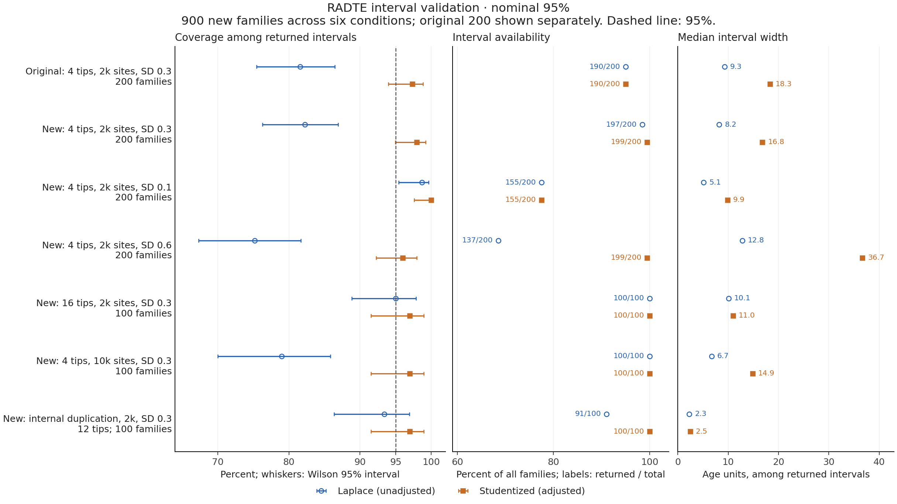

# Preliminary RADTE validation, 2026-09-09

The tables below retain the historical implementations identified by their
saved source hashes. The later [variance-boundary and exact-contrast work](examples/radte/interval-boundary-validation/README.md)
has separate evidence and does not retrospectively re-label these results as
validation of the current implementation. In particular, the general sequence
calibrated-profile prototype has not met its availability criteria.

The implementation passes its numerical and input/output contract tests.
Small simulation comparisons support useful speed and point-estimation
behavior, but **do not establish general high accuracy or nominal interval
coverage**. The native estimator remains experimental. In particular,
conditional MAP fallback was common and curvature intervals were often
unavailable in the wider-calibration cases.

Raw measurements and settings are in
[`examples/radte/validation-results.json`](examples/radte/validation-results.json).
The scripts retain individual command lines, inputs, process logs, manifests,
and complete results in their output directories. See [RADTE.md](RADTE.md) for
reproduction commands and [RADTE_MATH.md](RADTE_MATH.md) for the estimator.

## Numerical and behavioral checks

* Closed-form two-tip JC69 likelihood versus scaled pruning; branch derivatives
  versus finite differences for DNA and protein models; transition probabilities
  versus an independent matrix exponential.
* Full root-pair reduction, quadratic gradient/Hessian checks, and local
  approximation validation against exact likelihood.
* Marginal root-rate integration versus independent two-dimensional Gaussian
  quadrature, including posterior rate means; finite differences of age, mean,
  and variance gradients with independent and correlated rates.
* Invariance to the arbitrary split of reversible root-edge lengths; fixed-model
  sequence refits also remove dependence of estimated rate variance on supplied
  starting branch lengths.
* Shared species ages in point estimates, bootstrap refits, paired input
  chronograms, and real MCMCTree mirror samples. Input-ensemble tests check
  correlated species dates and changing gene-clade/event presence.
* Infeasible chronology, transfers, malformed annotations, missing leaves,
  nonpositive lengths, input/output collisions, and rollback of failed writes.
* Actual MCMCTree direct and approximate (`usedata=3` then `2`) runs; posterior
  sample counts, mirror equality, soft-bound labeling, and convergence diagnostics.

## Same-alignment reference comparison

Ten independent simulated four-tip gene families each contain two copies of
a two-species tree. The true duplication age is 20, species age is fixed at 10,
independent log-rate SD is 0.3, and each alignment has 2,000 JC69 sites. Seeds are
1701–1710. This is a deliberately small assessment, not a representative power
study. Branch-only inference receives the simulated true substitution lengths,
so it has different information from the sequence methods.

| Method | Median full-process time | Max process RSS | Duplication RMSE | Interval availability | Coverage among available |
|---|---:|---:|---:|---:|---:|
| Native, exact input branches | 1.25 s | 134 MiB | 3.54 | 10/10 | 9/10 |
| Native, sequence auto | 3.12 s | 152 MiB | 3.08 | 9/10 | 9/9 |
| MCMCTree, direct likelihood | 19.98 s | 252 MiB | 3.98 | 10/10 | 9/10 |
| MCMCTree, approximate likelihood | 4.08 s | 240 MiB | 3.98 | 10/10 | 9/10 |

Times include interpreter startup, reconciliation, all sequence precomputation,
inference, diagnostics, and output. Native measurements have one excluded warmup
and three measured runs per family. PAML reference accuracy uses one run per
family, two chains per run, 2,000 burn-in iterations, 20,000 saved samples per
chain, and thinning by 10. A separate initial comparison repeated the first
families three times after warmup and produced identical seeded posterior means;
the definitive table uses the complete ten-family batch. Peak RSS is the largest
process, not the sum of concurrently resident processes.

All ten direct and approximate PAML runs passed the implemented basic split
R-hat (<1.05) and ESS (≥200) thresholds. All native runs satisfied their hard
constraints. All methods had zero discrepancy between shared ages. Nine native
sequence fits rejected the quadratic approximation and used exact conditional
MAP. The remaining marginal fit reached the numerical variance boundary and
correctly declined a curvature interval.

On this workload native sequence inference was approximately 6.4 times faster
than direct PAML and 1.3 times faster than approximate PAML. These are observed
workflow timing ratios for different estimators, **not equivalent-posterior
speedups**. PAML uses soft priors and posterior means; native inference uses
hard calibrations and conditional MAP or marginal likelihood. The apparent RMSE
difference has substantial Monte Carlo uncertainty with only ten families.
Availability must be reported alongside coverage; nine available intervals do
not establish that a nominal 95% method is calibrated.

Environment: Python 3.10.14 (x86_64), NumPy 1.26.4, SciPy 1.15.2, macOS 26.6.2,
PAML 4.10.10. The JSON records the processor and executable hash. These numbers
should not be transferred directly to another architecture or Python/BLAS build.

## Scaling and sensitivity checks

With 1,000 sites, one family per size and three measured repetitions after
warmup:

| Gene tips | Branch-only time | Sequence time | Sequence max RSS |
|---|---:|---:|---:|
| 16 | 1.28 s | 4.26 s | 163 MiB |
| 64 | 1.27 s | 14.04 s | 246 MiB |

Both sequence cases used exact fallback. The 64-tip likelihood prefit contained
a boundary branch, so a regular quadratic approximation was unavailable. Its
curvature age interval was also unavailable. These two runs are scaling probes,
not an accuracy assessment at those sizes.

Three-family probes additionally covered internal duplications with non-root
species calibrations widened by 20%; losses with a threefold copy-wide rate
shift; and deliberately incorrect tip-to-species mappings. All runs completed
with valid shared ages and retained native chronology constraints. Sequence
duplication RMSEs were 0.38 (true age 7.5, internal duplication), 2.21 (true age
20, losses/rate shift), and 0.79 (true age 20, one wrong mapping).

Curvature intervals were unavailable for all internal-duplication and wrong-map
cases. A separate branch-only profile run on the internal-duplication case
returned calibration-limited intervals. The wrong-map probe evaluates only the
original root duplication; it does not validate newly inferred events or show
that erroneous reconciliation is harmless or automatically detectable.

## Original R RADTE workflow

`tools/benchmark_radte_reference.py` uses the original repository's 13-tip
GeneRax example and species bounds, with `chronos_model=discrete`, lambda 1,
maximum age 1000, and seed 1. Three measured runs after warmup gave median
6.08 s / 148 MiB for original R RADTE and 1.41 s / 133 MiB for native RADTE.
The rooted topology was identical, and both outputs were ultrametric to their
serialization precision. Root ages differed (452.44 versus 485.82).

The objective functions, selected constraints, and output bundles differ;
the R workflow also produces figures. The interval-only calibrations in this
example admit a scale ridge in the native model. Its reported age is therefore
not a uniquely identified estimate. This comparison checks input compatibility
and provides a workflow baseline; it is not an accuracy or numerical-equivalence
claim. Native inference now explicitly diagnoses the feasible common-scale
ridge even with a single optimizer start.

## Remaining scientific limits

Broader, prospectively specified simulation studies are needed across family
sizes, sequence lengths, calibration dependence, rates, and topology errors.
The present evidence is insufficient to promote curvature intervals as general
95% uncertainty estimates or claim that the marginal approximation always
replaces MCMCTree. Existing fast dating programs were not benchmarked as if they
implemented the same duplication and shared-event constraints.


## Small-sample interval validation

The [September 2026 workflow benchmark](https://github.com/kfuku52/nwkit/wiki/RADTE-performance)
found 155 true ages inside 190 returned nominal 95% native Laplace intervals
from 200 independent four-tip/2,000-site families: **81.6% coverage among
returned intervals**, with 10 families returning no interval. The follow-up
below reproduces that result and tests an explicit `--uncertainty studentized`
alternative. It does not redefine the original Laplace calculation or change
point estimates, fitted rates, auto-estimator selection, or chronology bounds.

### Cause and controlled checks

Only four non-root branches inform the rate-variance estimate in the exact
conditional sequence fit for this condition. The Gaussian curvature interval
holds that estimated variance fixed and uses a normal critical value. Marginal
inference includes an estimated SD parameter, but its ML variance estimate and
Gaussian reference approximation still have small-sample limitations.

On the original 200 families, the auto fit's mean estimated log-rate SD was
0.241, versus the generating SD of 0.3. In a controlled **exact-only** comparison,
holding SD at its generating value increased Laplace coverage from **164/200
(82.0%) to 188/200 (94.0%)**. Auto with supplied true SD covered 185/200 (92.5%);
its estimator-selection path can also change. These oracle comparisons diagnose
a source of undercoverage; they do not assume that real users know the true SD.

Independent second differences of the objective, using three step sizes on
four families and both exact/marginal fits, agreed with gradient-based curvature:
the maximum relative difference in the age standard error was **0.0032%**.
The evidence therefore points to variance estimation and small-sample reference
approximations, rather than a simple Hessian scaling or derivative error.

The new method uses residual rate degrees of freedom, an `n/df` curvature
variance correction, a t critical value, and a bounded age transformation.
The formula is derived from a local Gaussian regression approximation; no
multiplier was fitted to achieve a target coverage on these data. See
[the mathematical definition and limits](RADTE_MATH.md#small-sample-curvature-adjustment).

### Independent-family results

After choosing the correction on the original cases, six new conditions and
new seed ranges were specified and evaluated, totaling **900 new families**.
All 1,100 distinct families (original plus new) completed point inference.
The native sequence `auto` fit was shared by the two interval calculations,
and paired point estimates/parameters were checked for exact equality. The
recomputed original Laplace endpoints agree with the archived ones to within
`4e-15` age units. These are development-checkout results; source-file hashes,
not the package version string alone, identify the tested implementation.



Coverage denominators below are **returned intervals**. Comparing them with the
family count exposes unavailable intervals. Widths are medians among returned
intervals, in input age units. Root-duplication truth is 20; the internal case
has truth 7.5 and 12 gene tips from eight species.

| Condition | Families | Laplace: covered / returned | Studentized: covered / returned | Median width: Laplace → studentized |
| --- | --- | --- | --- | --- |
| Original 4 tips, 2,000 sites, SD 0.3 | 200 | 155/190 (81.6%) | 185/190 (97.4%) | 9.29 → 18.34 |
| New 4 tips, 2,000 sites, SD 0.3 | 200 | 162/197 (82.2%) | 195/199 (98.0%) | 8.23 → 16.81 |
| New 4 tips, 2,000 sites, SD 0.1 | 200 | 153/155 (98.7%) | 155/155 (100.0%) | 5.15 → 9.87 |
| New 4 tips, 2,000 sites, SD 0.6 | 200 | 103/137 (75.2%) | 191/199 (96.0%) | 12.79 → 36.65 |
| New 16 tips, 2,000 sites, SD 0.3 | 100 | 95/100 (95.0%) | 97/100 (97.0%) | 10.09 → 10.98 |
| New 4 tips, 10,000 sites, SD 0.3 | 100 | 79/100 (79.0%) | 97/100 (97.0%) | 6.70 → 14.85 |
| New internal duplication, 12 tips, 2,000 sites, SD 0.3 | 100 | 85/91 (93.4%) | 97/100 (97.0%) | 2.27 → 2.45 |

On the original families, a correct interval was returned for **77.5% → 92.5%**
of all 200 families; on the new primary condition the corresponding values
were **81.0% → 97.5%**. Conditional coverage alone must not hide missing intervals.
The new primary studentized coverage is 195/199 = **98.0%**, with a Wilson 95%
interval of **94.9–99.2%**. It is more conservative, with approximately twice
the original median interval width. In the low-SD condition, 45/200 families
still return no interval and all 155 returned adjusted intervals contain truth.
This is conservative conditional coverage with incomplete availability, not a
successful interval for every family. No boundary failure is converted into
a narrow or degenerate confidence interval.

A separate known-SD check reuses the same 200 new primary families: unadjusted
Laplace covers 188/200 (94.0%) and the bounded-normal variant selected by
`studentized --rate-sd 0.3` covers 189/200 (94.5%). These are not 200 additional
independent families. The adjustment does not integrate substitution-model,
topology, reconciliation, or external calibration uncertainty, and the six
conditions do not establish universal 95% calibration.

### Reproduction and evidence

[Per-family paired results](examples/radte/interval-coverage.csv) and
[summary, parameters, source hashes and environment](examples/radte/interval-coverage-summary.json)
are included. The runs used Python 3.10.14, NumPy 1.26.4 and SciPy 1.15.2 with
x86_64 executables under Rosetta on the same Apple M2 Max host. This is a
statistical validation study, not a new runtime benchmark.

From the checkout, regenerate the new primary condition with:

```sh
PYTHONPATH=. OPENBLAS_NUM_THREADS=1 OMP_NUM_THREADS=1 \
  MKL_NUM_THREADS=1 VECLIB_MAXIMUM_THREADS=1 NUMEXPR_NUM_THREADS=1 \
  python tools/validate_radte_intervals.py \
  --species 2 --sites 2000 --rate-sd 0.3 --families 200 \
  --seed 91300000 --output /tmp/radte-interval-primary
```

The output directory must be new. `--input-root` can reuse directories named
`f000`, `f001`, etc., containing the simulator's input files; an existing
`ml.nhx` takes precedence over `gene.nwk`. A failed point fit is retained in
both methods' denominators. The paired CSV/JSONL and metadata retain seeds,
input hashes, unavailable statuses, fitted SDs, actual estimators, and source
hashes. Seeds identify both simulation and optimizer initialization. For the
remaining conditions, use the following values with separate output directories:

| New condition | Species | Sites | Simulated SD | Scenario | Families | First seed |
| --- | --- | --- | --- | --- | --- | --- |
| Low rate variation | 2 | 2000 | 0.1 | root | 200 | 91310000 |
| High rate variation | 2 | 2000 | 0.6 | root | 200 | 91320000 |
| Larger family | 8 | 2000 | 0.3 | root | 100 | 91330000 |
| Longer alignment | 2 | 10000 | 0.3 | root | 100 | 91340000 |
| Internal duplication | 8 | 2000 | 0.3 | nested | 100 | 91350000 |

For the oracle comparison, repeat the primary command with `--fit-rate-sd 0.3`.
The original 200 cases use the frozen inputs linked from the workflow benchmark.
Their seed range begins at 20260909; they are diagnostic/reproduction cases,
not held-out evidence.

Regression checks cover the local Gaussian formula, observation/degree counts
for both sequence estimators, supplied-SD behavior, hard-domain propagation
against independent linear programs, shared ages, unavailable/stale intervals,
and CLI output. Broader RADTE/CLI tests include the exact and approximate PAML
references; IQ-TREE integration is checked separately with its required local
IQ2MC/session extension.

## Native GY94 default-profile study (2026-09-10)

The [external-sequence default-profile study](examples/radte/default-profile-validation/README.md)
records 400 primary and 250 stress families with fixed species ages, independently
generated AliSim codon alignments, and refitted native GY94/F3x4 + G4 likelihoods.
This is a distinct experiment from branch-observation interval validation above.
Nominal 95% profile intervals show condition-dependent undercoverage; unavailable
intervals and failed points remain in their original denominators.

One internal family exposed a collapsed branch-only warm start. Resetting that
near-minimum-duration sequence initializer to the existing chronology interior
repairs a feasible optimization failure without changing the objective or age
constraints. The original study retains its failure; the retained regression
fixture and a separate 20-family post-fix check are described in that record.
Neither this numerical repair nor the exploratory plot labels establish 95%
coverage. Species-age uncertainty is not propagated in this study.
