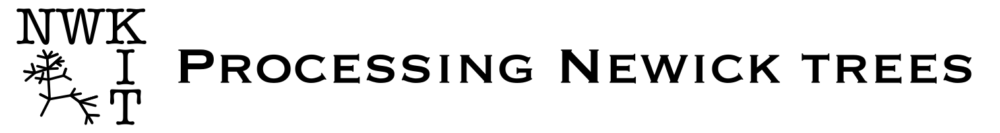
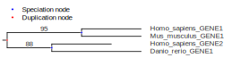

[](https://github.com/kfuku52/nwkit/actions/workflows/tests.yml)
[](https://github.com/kfuku52/nwkit/releases)
[](https://anaconda.org/bioconda/nwkit)
[](https://github.com/kfuku52/nwkit)
[](https://anaconda.org/bioconda/nwkit)
[](https://anaconda.org/bioconda/nwkit)
[](https://opensource.org/licenses/MIT)

## Overview
**NWKIT** ([/njuːkit/](http://ipa-reader.xyz/?text=nju%CB%90kit&voice=Joanna)) is a toolkit for manipulating phylogenetic trees in the [Newick format](https://en.wikipedia.org/wiki/Newick_format). 

## Installation

The latest version of NWKIT is available from [Bioconda](https://anaconda.org/bioconda/nwkit). For users requiring a `conda` installation, please refer to [Miniforge](https://github.com/conda-forge/miniforge) for a lightweight conda environment.

#### Install from Bioconda

```
conda install bioconda::nwkit
```

#### Verify the installation by displaying the available options

```
nwkit -h
```

#### (For advanced users) Install the development version from GitHub

```
pip install git+https://github.com/kfuku52/nwkit
```

#### Optional dependencies for image post-processing

`nwkit image` can normalize image format, trim margins, and resize/pad output files when the optional image-processing dependencies are installed:

```
pip install "nwkit[image]"
```

## Subcommands
See [Wiki](https://github.com/kfuku52/nwkit/wiki) for usage.

Most tree-reading subcommands default to `--format auto`. If your input uses unquoted numeric internal node names, `--format auto-strict` will fail instead of guessing between support values (`0`) and internal node names (`1`).

`--species_regex` is available in species-aware subcommands including `draw`, `info`, `image`, `root`, and `subtree`. The default regex works for both `GENUS_SPECIES` and `GENUS_SPECIES_GENEID` labels. If the regex contains capture groups, non-empty captured groups are joined with underscores.

For example, labels such as `Homo.sapiens|GENE1` can be parsed with:

```bash
--species_regex '^([A-Za-z]+)\.([A-Za-z]+)\|'
```

This affects:

- `nwkit info`: species counting
- `nwkit image`: leaf-to-species mapping
- `nwkit draw`: speciation/duplication node annotation
- `nwkit root --method taxonomy`: taxonomy-based species lookup
- `nwkit subtree --orthogroup yes`: species-aware orthogroup delimitation

- [`constrain`](https://github.com/kfuku52/nwkit/wiki/nwkit-constrain): Generating a species-tree-like Newick file for topological constraint
- [`dist`](https://github.com/kfuku52/nwkit/wiki/nwkit-dist): Calculating topological distance between two trees
- [`draw`](#example-tree-drawing): Drawing a phylogenetic tree with optional speciation/duplication node markers
- [`drop`](https://github.com/kfuku52/nwkit/wiki/nwkit-drop): Removing node and branch information
- [`image`](https://github.com/kfuku52/nwkit/wiki/nwkit-image): Retrieving representative species images with license-aware filtering
- [`info`](https://github.com/kfuku52/nwkit/wiki/nwkit-info): Printing tree information
- [`intersection`](https://github.com/kfuku52/nwkit/wiki/nwkit-intersection): Dropping non-overlapping leaves/sequences between two trees or between a tree and an alignment
- [`label`](https://github.com/kfuku52/nwkit/wiki/nwkit-label): Adding unique node labels
- [`mark`](https://github.com/kfuku52/nwkit/wiki/nwkit-mark): Adding texts to node labels by identifying the targets with a leaf name regex
- [`mcmctree`](https://github.com/kfuku52/nwkit/wiki/nwkit-mcmctree): Introducing divergence time constraints for PAML's mcmctree
- [`nhx2nwk`](https://github.com/kfuku52/nwkit/wiki/nwkit-nhx2nwk): Generating Newick from NHX
- [`printlabel`](https://github.com/kfuku52/nwkit/wiki/nwkit-printlabel): Searching and printing node labels
- [`prune`](https://github.com/kfuku52/nwkit/wiki/nwkit-prune): Pruning leaves
- [`rescale`](https://github.com/kfuku52/nwkit/wiki/nwkit-rescale): Rescale branch length with a given factor
- [`root`](https://github.com/kfuku52/nwkit/wiki/nwkit-root): Placing or transferring the tree root
- [`sanitize`](https://github.com/kfuku52/nwkit/wiki/nwkit-sanitize): Eliminating non-standard Newick flavors
- [`shuffle`](https://github.com/kfuku52/nwkit/wiki/nwkit-shuffle): Shuffling branches and/or labels
- [`skim`](https://github.com/kfuku52/nwkit/wiki/nwkit-skim): Sampling leaves from clades with shared traits
- [`subtree`](https://github.com/kfuku52/nwkit/wiki/nwkit-subtree): Generating a subtree Newick file
- [`transfer`](https://github.com/kfuku52/nwkit/wiki/nwkit-transfer): Transferring information between trees

## Example: tree drawing

Draw a tree to `pdf`, `png`, or `svg`:

```bash
nwkit draw -i tree.nwk -o tree.svg
```

When leaf labels follow the `GENUS_SPECIES[_...]` convention, `nwkit draw` marks speciation nodes in blue and duplication nodes in red by default:

```bash
nwkit draw -i tree.nwk -o tree.svg \
  --species_regex '^([^_]+_[^_]+)(?:_|$)'
```

If support values are attached to internal branches, they are printed on the corresponding horizontal branches.

If some tip labels do not match `--species_regex`, node markers are skipped in the default `--species_overlap_node_plot auto` mode. To disable node markers explicitly:

```bash
nwkit draw -i tree.nwk -o tree.svg --species_overlap_node_plot no
```

Example output:



## Example: species image retrieval

Retrieve one representative asset per species from a tree whose leaf labels follow the `GENUS_SPECIES[_...]` convention:

```bash
nwkit image -i tree.nwk --out_dir species_images
```

For alternative leaf-label conventions, override species parsing with `--species_regex`:

```bash
nwkit image -i tree.nwk --out_dir species_images \
  --species_regex '^([A-Za-z]+)\.([A-Za-z]+)\|'
```

## Example: species-aware parsing in other commands

Count species from non-standard leaf labels:

```bash
nwkit info -i tree.nwk \
  --species_regex '^([A-Za-z]+)\.([A-Za-z]+)\|'
```

Use taxonomy rooting on non-standard leaf labels:

```bash
nwkit root -i tree.nwk --method taxonomy \
  --species_regex '^([A-Za-z]+)\.([A-Za-z]+)\|'
```

Use orthogroup delimitation on non-standard leaf labels:

```bash
nwkit subtree -i tree.nwk --leaves GENE1,GENE2 --orthogroup yes \
  --species_regex '^([A-Za-z]+)\.([A-Za-z]+)\|'
```

Prefer silhouettes:

```bash
nwkit image -i tree.nwk --out_dir species_images --style silhouette
```

Restrict the provider order and relax the license ceiling:

```bash
nwkit image -i tree.nwk --out_dir species_images \
  --source phylopic,bioicons,inaturalist,wikimedia,gbif,eol,idigbio,openverse,ncbi \
  --license_max any
```

The command writes:

- `manifest.tsv`: machine-readable asset metadata per input leaf
- `unmatched.tsv`: unresolved or filtered taxa with reasons
- `ATTRIBUTION.md`: human-readable attribution summary
- `images/`: downloaded media files

Optional image post-processing controls:

- `--output_format original|png|jpg`: normalize the final file format
- `--max_edge INT`: downscale the longest edge to this maximum size
- `--canvas none|square`: pad images to a square canvas
- `--background white|transparent`: background for square padding
- `--trim off|white|transparent|semantic`: trim white margins, transparent margins, or a best-effort foreground subject
- `--trim_shape bbox|square`: keep the trimmed bounding box as-is or center-crop the trimmed result to a square

For example, to normalize a mixed set of downloaded images into padded 1024 px PNG files:

```bash
nwkit image -i tree.nwk --out_dir species_images \
  --output_format png \
  --max_edge 1024 \
  --canvas square \
  --background white \
  --trim white
```

If you want the trimmed content itself to become square before resizing, add `--trim_shape square`. This uses a centered square crop, so elongated subjects may be clipped.

`--trim semantic` is a Pillow-only best-effort heuristic. It uses alpha when available, otherwise it estimates the main subject from the largest foreground-like region against the border background. It works well for simple backgrounds, but it is not a full segmentation model.

When `--download_dir` is provided, NWKIT reuses that shared cache directory for both the ETE4 taxonomy database and downloaded image assets.

For larger trees, concurrency can be tuned with environment variables:

- `NWKIT_IMAGE_LOOKUP_WORKERS`: override the number of parallel species lookups
- `NWKIT_IMAGE_DOWNLOAD_WORKERS`: override the number of parallel download/materialization workers

Bioicons vector illustrations are supported via `--source bioicons` and work best as a silhouette-style fallback for model organisms and other taxa with curated icons.

EOL media aggregation is supported via `--source eol`.

iDigBio specimen-linked media are supported via `--source idigbio`.

Openverse search aggregation is supported via `--source openverse` and works best as a late fallback because it is broader keyword search rather than taxonomy-native indexing.

NCBI taxonomy images are supported via `--source ncbi`.
By default, `ncbi` is appended to the `auto` and `photo` source lists as a lazy fallback, so the heavy NCBI image-table download is triggered only when earlier providers did not yield an acceptable candidate.

## Citation
There is no published paper on NWKIT itself, but we used and cited NWKIT in several papers including [Fukushima & Pollock (2023, Nat Ecol Evol 7: 155-170)](https://www.nature.com/articles/s41559-022-01932-7).

The `--method mad` option in `nwkit root` uses [MAD](https://www.mikrobio.uni-kiel.de/de/ag-dagan/ressourcen) by Tria, Landan & Dagan. If you use this option, please cite: [Tria et al. (2017, Nat Ecol Evol 1: 0193)](https://doi.org/10.1038/s41559-017-0193).

# Licensing
This program is MIT-licensed. See [LICENSE](LICENSE) for details.
