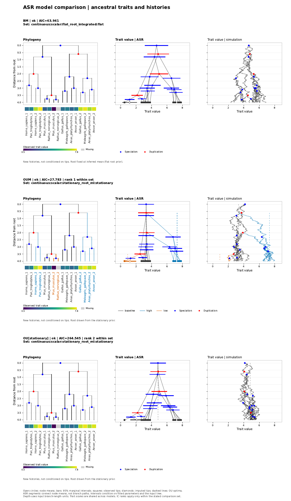
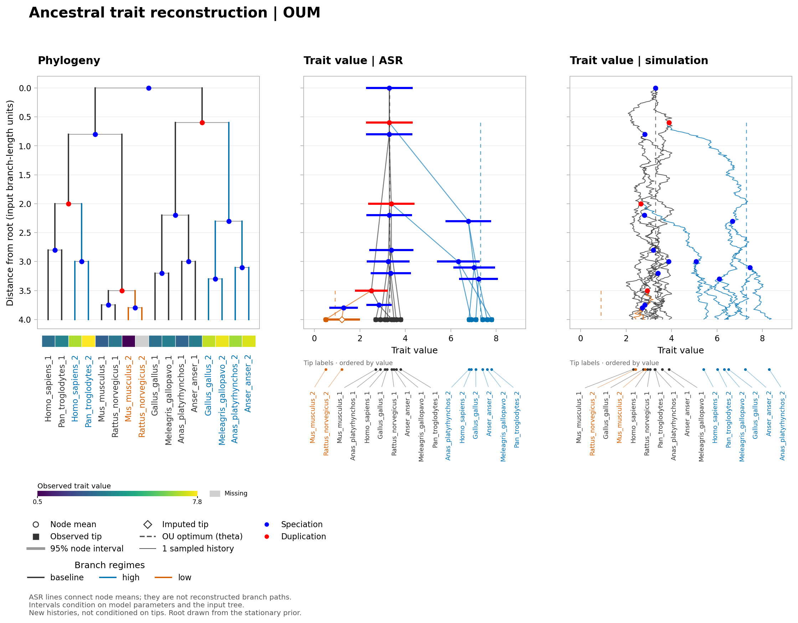

# Continuous ASR figure example

This is a hand-constructed demonstration, not data from the motivating paper.
The 16-tip tree is strictly bifurcating, including its root, with three supplied regimes. Trait values, regime assignments,
and OU parameters are illustrative; regime shifts are not discovered by this
example. Tip `Rattus_norvegicus_2` is deliberately missing. Internal labels in the regime map use
NWKIT's level-order `branch_id` values for this exact tree.

From the repository root:

```sh
nwkit asr \
  -i examples/asr_figure/tree.nwk \
  --trait examples/asr_figure/traits.tsv \
  --state-column "Trait value" --figure-tip-heatmap yes --figure-trait-tip-labels yes \
  --model OUM \
  --regime-map examples/asr_figure/regimes.tsv \
  --regime-parameters examples/asr_figure/parameters.tsv \
  --alpha 1.2 --sigma2 0.6 \
  -o /tmp/asr-nodes.tsv \
  --figure-out /tmp/asr.pdf
```

Use a `.png` or `.svg` suffix for other formats. The included preview was
generated by the same command with `--figure-out examples/asr_figure/preview.png`.
Root-to-tip depth is four input branch-length units, not four million years.

The design follows the shared-depth arrangement of
[Fukushima and Pollock (2020), Fig. 2a](https://www.nature.com/articles/s41467-020-18090-8/figures/2).
Here, node means and conditional marginal intervals replace simulated continuous
paths. Solid connectors are visual links between node means, not estimated
branch trajectories. The diamond marks the imputed value for `Rattus_norvegicus_2`. Dashed lines
show the supplied regime optima, not posterior means.


The synthetic trait is labeled `Trait value`; its TSV column name contains a
space and is quoted in the commands. Tip labels are vertical (90 degrees).

The tips represent two copies of eight species, with three independent
duplication nodes: one in the primate clade (Homo/Pan), one in the rodent clade
(Mus/Rattus), and one in the bird clade (Gallus/Meleagris/Anas/Anser). The default
species parser ignores the trailing copy number. Species overlap labels the
root as speciation (blue), exactly three internal nodes as duplication (red),
and the other twelve internal nodes, including the root, as speciation.
Every duplication has a speciation parent and two speciation children, so all
three explicitly contain the ancestor-to-descendant sequence
**speciation -> duplication -> speciation**. The tree is strictly bifurcating.

The duplication depths are spread across 0.6 (birds), 2.0 (primates), and
3.5 (rodents), measured from the root. With tips at depth 4, the rodent
duplication lies near the terminal branches; its daughter speciations occur
at depths 3.75 and 3.8.

The duplication nodes have branch IDs 2 (birds), 3 (primates), and 4 (rodents).
Event classification is shared by the phylogeny, ASR, and simulation. Branch
colors separately encode the supplied regimes: ancestors and copy 1 remain
baseline, primate/bird copy 2 is high, and rodent copy 2 is low. These are
illustrative assigned shifts, not shifts discovered by the model. The 31-node
regime map was regenerated for this exact tree; root-to-tip depth remains four
branch-length units.

Set `--species-overlap-node-plot no` to disable event colors, or use the shared
`--species-parser`, `--species-regex`, or `--species-map-tsv` options for different
naming conventions. Unclassified simulated branching nodes still have neutral
circles. Circles mark sampled values at original nodes, not the extra grid points.

## Add a simulated history

This command generates the additional simulation panel shown below:

```sh
nwkit asr \
  -i examples/asr_figure/tree.nwk \
  --trait examples/asr_figure/traits.tsv \
  --state-column "Trait value" --figure-tip-heatmap yes --figure-trait-tip-labels yes \
  --model OUM \
  --regime-map examples/asr_figure/regimes.tsv \
  --regime-parameters examples/asr_figure/parameters.tsv \
  --alpha 1.2 --sigma2 0.6 \
  --figure-out examples/asr_figure/simulation.png \
  --figure-simulations 1 --seed 7 \
  -o /tmp/asr-simulation-nodes.tsv
```

The right panel is a new latent evolutionary history from the specified model,
not a reconstruction conditioned on the observed tips. Its root is drawn from
the stationary distribution of the baseline regime. Every daughter starts at
its parent's simulated value. Branch-interior points are drawn with exact OU
transitions; the display connects a finite grid (200 steps on the longest branch).

Use `--figure-simulation-mode conditional` for a posterior history pinned to
the error-free observations, with `Rattus_norvegicus_2` still imputed. Increase `--figure-simulations`
to overlay independent histories. Both modes condition on the selected parameter
values and tree. They do not add parameter or tree uncertainty.


## Compare models on one page

```sh
nwkit asrcompare \
  -i examples/asr_figure/tree.nwk \
  --trait examples/asr_figure/traits.tsv --state-column "Trait value" --figure-tip-heatmap yes --figure-trait-tip-labels yes \
  --models BM,OU,OUM \
  --regime-map examples/asr_figure/regimes.tsv \
  --regime-parameters examples/asr_figure/parameters.tsv \
  --alpha 1.2 --sigma2 0.6 \
  --figure-layout panels --figure-out /tmp/asr-model-panels.pdf \
  --figure-simulations 1 --seed 7 -o /tmp/asr-model-comparison.tsv
```

This creates one vector PDF page with a row per model. The OUM parameters and
all regime optima are supplied; OU estimates a single optimum, while BM uses
the supplied diffusion variance. It illustrates plotting, not an unbiased model
selection experiment. The flat-root BM model belongs to a different likelihood
comparison set from stationary-root OU/OUM and does not receive a rank against
them. Within the stationary set, rows are ordered by AIC. Shared value limits
make the ASR and sampled histories directly comparable visually.



The heatmap below each phylogeny displays the observed values in tip order,
using the same 0.5-7.8 scale in every model. `Rattus_norvegicus_2` is gray because
its observation is missing; its ASR-imputed value is shown only in the ASR panel.
The numeric color key is below the vertical tip names. Omit
`--figure-tip-heatmap yes` to hide the heatmap; omit
`--figure-trait-tip-labels yes` to hide the trait-panel label strips.

## Optional labels under trait panels

The commands above enable `--figure-trait-tip-labels yes` to show full tip
names under the ASR and simulation panels. The detached strips repeat the tip
values on the same x scale and fan out to evenly spaced, value-ordered names.
ASR uses posterior tip means (including imputed tips); simulation uses endpoints
of the first sampled history, identified explicitly when several are drawn.
Regime colors match the corresponding branches. These labels are off by default.



Automatic figure width reserves label spacing in each equal-width column, so
many tips and traits can produce a wide page. `--figure-width` overrides that
size and may crowd labels. Standalone ASR and comparison figures select an
installed font covering the tip and trait names; install a suitable font if
those characters are unavailable on your system.

Multivariate simulation checks estimated matrix and sample-array memory before
subdividing branches (512 MiB limit). Conditional histories retain more matrices
than unconditional histories. Reduce `--figure-simulation-steps`, the history
count, or the number of traits when the limit is exceeded.
