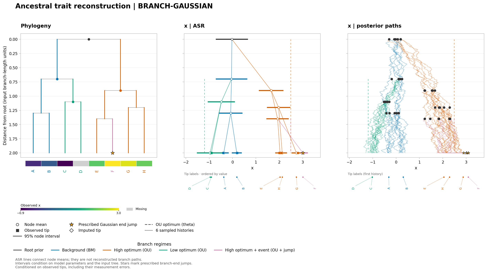

# Fit a fixed BM/OU layout and reconstruct ancestral traits

This eight-tip **synthetic illustration** uses the same observations and layout
as the [fixed-parameter plot example](../plot/README.md). It estimates diffusion
parameters while keeping every branch assignment, the Gaussian root
(mean 0, variance 0.2), the low OU optimum (−1.2), and F's prescribed end jump
(mean +0.9, variance 0.06) fixed. D has no observation; the other observations
have measurement SE 0.1. Nothing in this example searches for shifts or jumps.

[fit.tsv](fit.tsv) specifies three free groups:

| Group | Parameter and sharing | Initial | Bounds | Fitted value |
|---|---|---:|---|---:|
| rate | sigma2 shared across all BM/OU regimes | 0.3 | 0.01–3 | 0.188446 |
| pull | alpha shared across all OU regimes | 1.8 | 0–8 | 1.225343 |
| high | theta shared by the two high-optimum regimes | 2.5 | 0–5 | 2.487821 |

The supplied-root log likelihood improves from −3.427654 to −2.774865.
All six deterministic optimizer starts converge, the three groups have full
numerical local rank, and no estimate hits a bound. These diagnostics do not
establish global identifiability or a globally optimal fit.



Colors retain the specified regimes. The star marks the fixed end jump on F;
the diamond marks the missing D tip. Dashed optima and all node intervals/history
draws use fitted parameters. Intervals condition on those estimates and the
fixed tree/layout; they exclude parameter and model-selection uncertainty.

Reproduce all PNG/SVG/PDF and TSV/JSON outputs from the repository root:

```sh
OPENBLAS_NUM_THREADS=1 python examples/branch_gaussian/fit/render.py
```

The core invocation is:

```sh
nwkit asr --model BRANCH-GAUSSIAN \
  -i examples/branch_gaussian/fit/tree.nwk --input-rooted yes \
  --trait examples/branch_gaussian/fit/traits.tsv --state-column x \
  --standard-error-column se \
  --branch-regimes examples/branch_gaussian/fit/branch_regimes.tsv \
  --regime-models examples/branch_gaussian/fit/regime_models.tsv \
  --branch-fit examples/branch_gaussian/fit/fit.tsv \
  --root-prior gaussian --root-mean 0 --root-variance 0.2 \
  -o asr.tsv --model-out model.tsv --process-out process.json \
  --branch-models-out fitted-models.tsv --figure-out fitted.png
```

Outputs: [ASR](output/asr.tsv), [model summary](output/model.tsv),
[complete run and fitting diagnostics](output/process.json),
[reusable fitted branch models](output/branch-models.tsv),
[PNG](output/fitted.png), [SVG](output/fitted.svg), [PDF](output/fitted.pdf).
To replay the numerical ASR or simulate from the fitted model, use
`--branch-models fitted-models.tsv` with the same tree and root options, omitting
`--branch-fit`, `--branch-regimes`, and `--regime-models`. Replay treats the
estimates as fixed; it does not repeat estimation.
