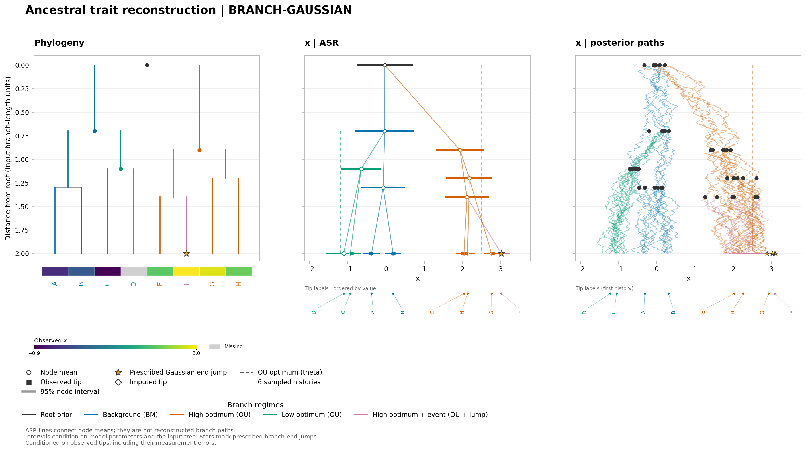
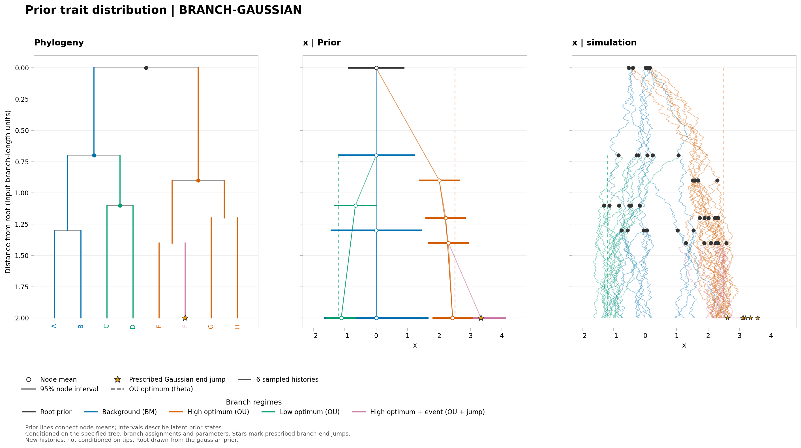

# Mixed BM/OU and end-jump figures

This is an illustrative eight-tip example, not an analysis of real observations.
All branch parameters and the Gaussian root (mean 0, variance 0.2) are fixed.

| Branches | Process |
| --- | --- |
| Background | BM, variance rate 0.25 |
| CD, C, D | OU, alpha 2, optimum −1.2, variance rate 0.2 |
| Right, EF, GH, E, G, H | OU, alpha 1.8, optimum 2.5, variance rate 0.35 |
| F | Same high-optimum OU, then a Gaussian jump with mean 0.9 and variance 0.06 |

D is missing. Other tips have supplied values and measurement SE 0.1.
Branch IDs in `branch_regimes.tsv` refer to the level-order IDs of `tree.nwk`;
regime names and parameters are in `regime_models.tsv`.

Run from the repository root after installing NWKIT:

```sh
python examples/branch_gaussian/plot/render.py
```

The script invokes `asr --model BRANCH-GAUSSIAN` and writes PNG, SVG and PDF
figures, posterior/prior TSVs, normalized branch models and process JSON records
to `output/`. Both runs use seed 39 and six plotted histories.

## Posterior reconstruction



Left: the tree and observed-tip heatmap. Center: posterior node means and 95%
intervals; the open diamond marks the imputed value for D. Squares are observed
values. Right: six joint conditional histories, including measurement-error
uncertainty. Branch colors indicate the assigned processes; dashed vertical
segments indicate OU optima. The yellow star marks the prescribed jump at the
end of F. Every sampled jump occurs at one instant after that branch's diffusion.
The straight center-panel connectors join node means only.

[SVG](output/posterior.svg) · [PDF](output/posterior.pdf) ·
[Summary TSV](output/posterior.tsv) · [Model TSV](output/posterior-model.tsv) ·
[Process JSON](output/posterior-process.json)

## Prior distribution and simulation



The same process with no trait input: center intervals are analytic marginal
prior intervals, and the right panel shows unconditional finite-grid histories.
Roots are drawn from the specified Gaussian distribution. No values are
estimated or imputed in this plot. The separate prior TSV contains six node-state
draws; it is not the endpoint export of the plotted grid histories.

[SVG](output/prior.svg) · [PDF](output/prior.pdf) ·
[Prior samples TSV](output/prior.tsv) · [Process JSON](output/prior-process.json)
