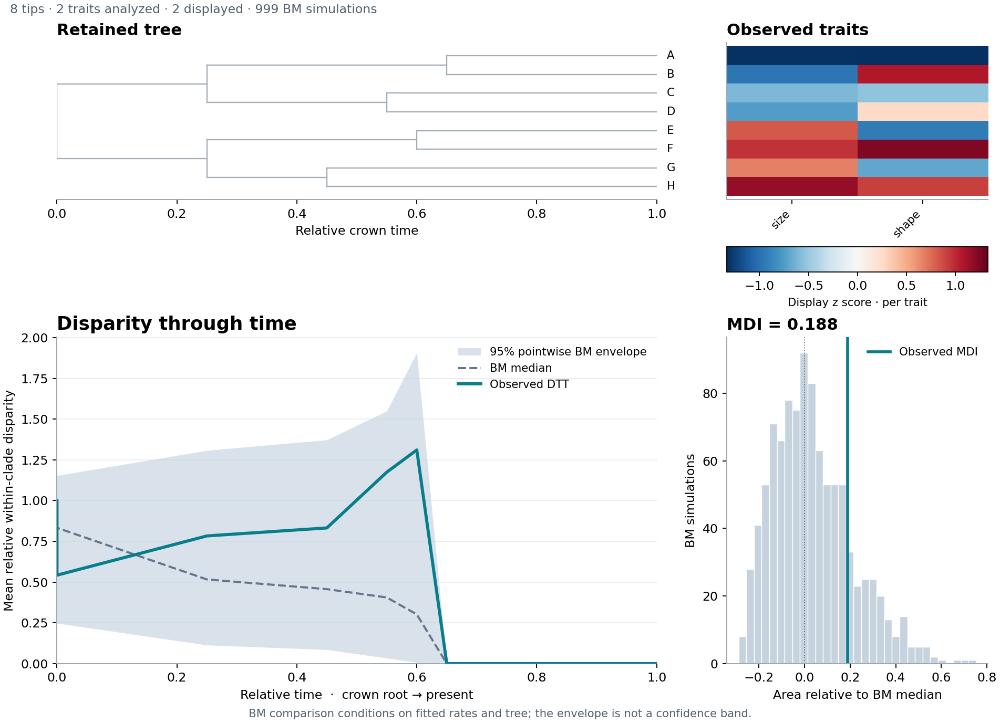
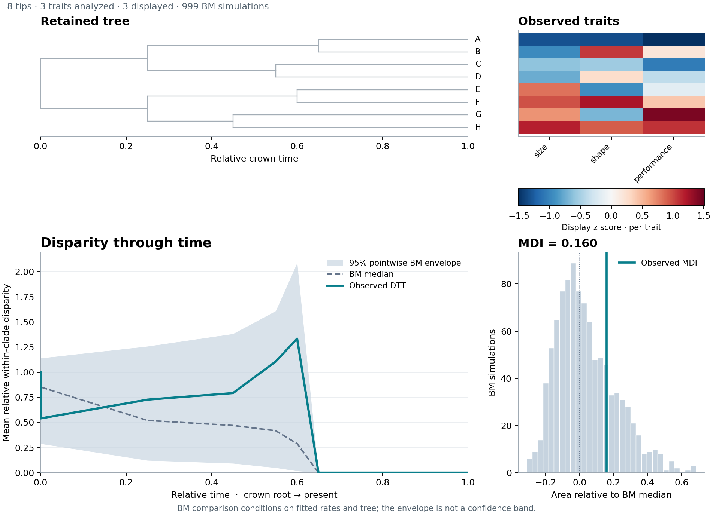

# Continuous-trait disparity example

This synthetic eight-tip tree and trait table are shared with the PCA example.
The figure uses the joint `size,shape` geometry and 999 fitted BM simulations.
From the repository root:

```sh
python -m nwkit dtt -i examples/dtt/tree.nwk \
  --trait examples/dtt/traits.tsv --columns size,shape \
  --n-sim 999 --seed 42 --threads 2 \
  -o /tmp/dtt.tsv --summary-out /tmp/dtt-summary.tsv \
  --model-out /tmp/dtt-model.json --figure-out examples/dtt/dtt.png
Rscript examples/dtt/reference.R
```



The upper tree shares an aligned relative-time axis with DTT below. The heatmap
shows observed traits using per-trait z scores for display, independently of the
raw geometry used by DTT. Gray branches do not show inferred ancestral states.
The teal curve is observed DTT; the dashed line and band show the BM median and
95% pointwise null envelope. See [DTT documentation](../../DTT.md) for conventions.

## Compact multi-trait view

Any number of displayed traits, including one, uses one tree plus a heatmap by
default. This example adds a third trait:

```sh
python -m nwkit dtt -i examples/dtt/tree.nwk \
  --trait examples/dtt/traits.tsv --columns size,shape,performance \
  --n-sim 999 --seed 42 --threads 2 \
  -o /tmp/dtt-heat.tsv --summary-out /tmp/dtt-heat-summary.tsv \
  --figure-out examples/dtt/heatmap.png
```



The heatmap colors are per-trait z scores for display; this example still uses
raw trait geometry for DTT. Use `--figure-columns size,performance` to display a
subset while retaining all three traits in the calculation. Selecting just one
displayed trait also retains this layout. `--figure-layout trees` explicitly
requests individual trees.
