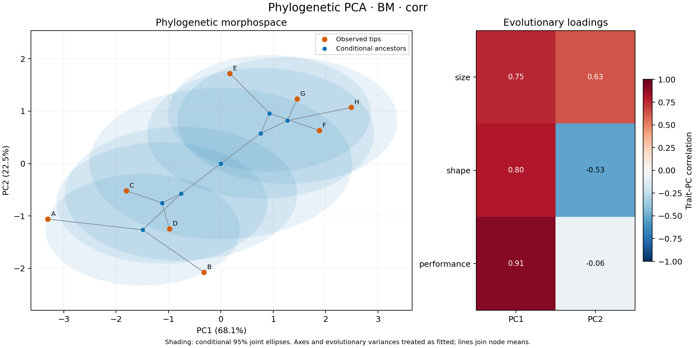

# Synthetic phylogenetic PCA

Eight tips have three synthetic traits with differing patterns of variation.
The tree has root-to-tip distance two. Values are treated as exact.

```sh
nwkit pca -i examples/pca/tree.nwk --trait examples/pca/traits.tsv \
  --columns size,shape,performance --mode corr \
  -o scores.tsv --loadings-out loadings.tsv --eigenvalues-out eigenvalues.tsv \
  --model-out pca.json --ancestral-out ancestors.tsv --figure-out morphospace.png
```



The displayed image uses the command above. Blue regions are conditional
ancestral uncertainty, treating the estimated axes and variances as fitted.
See [PCA.md](../../PCA.md) for the statistical assumptions and output schemas.
