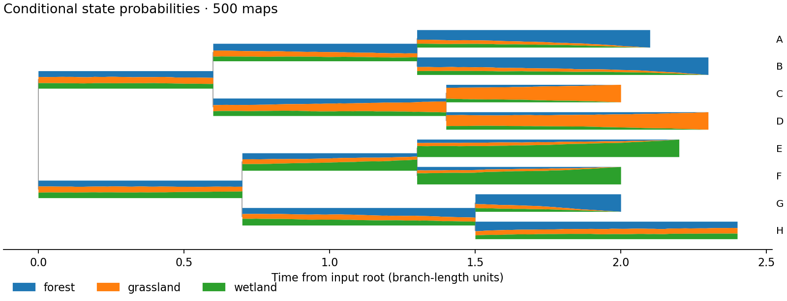

# Stochastic history example

This synthetic three-state example has a non-ultrametric tree and one unknown
tip state (`H`). From the repository root:

```bash
nwkit asr --infile examples/stochastic_maps/tree.nwk \
  --trait examples/stochastic_maps/traits.tsv --state-column habitat \
  --model ER --rate 0.65 --states forest,grassland,wetland \
  --n-sim 500 --seed 42 --threads 2 \
  --outfile /tmp/map-nodes.tsv --model-out /tmp/map-model.tsv \
  --stochastic-map-out /tmp/map-counts.tsv \
  --map-history-out /tmp/map-histories.tsv \
  --map-summary-out /tmp/map-durations.tsv --map-time-out /tmp/map-time.tsv \
  --map-probabilities-out /tmp/map-probabilities.tsv \
  --map-figure-out /tmp/map-probabilities.png
```



The checked-in image was generated with this command. Each color's ribbon
thickness is its sampled state probability; `H` remains uncertain. Coordinates
measure branch-length units forward from the root. Rate and tree uncertainty
are excluded. `--map-history-out` retains actual sampled histories and can be
used for custom event-time plots or summaries. The count table is identical to
running the same command with only `--stochastic-map-out` as its map output.

See [STOCHASTIC_MAPS.md](../../STOCHASTIC_MAPS.md) for all column definitions,
limits, and uncertainty conventions.
