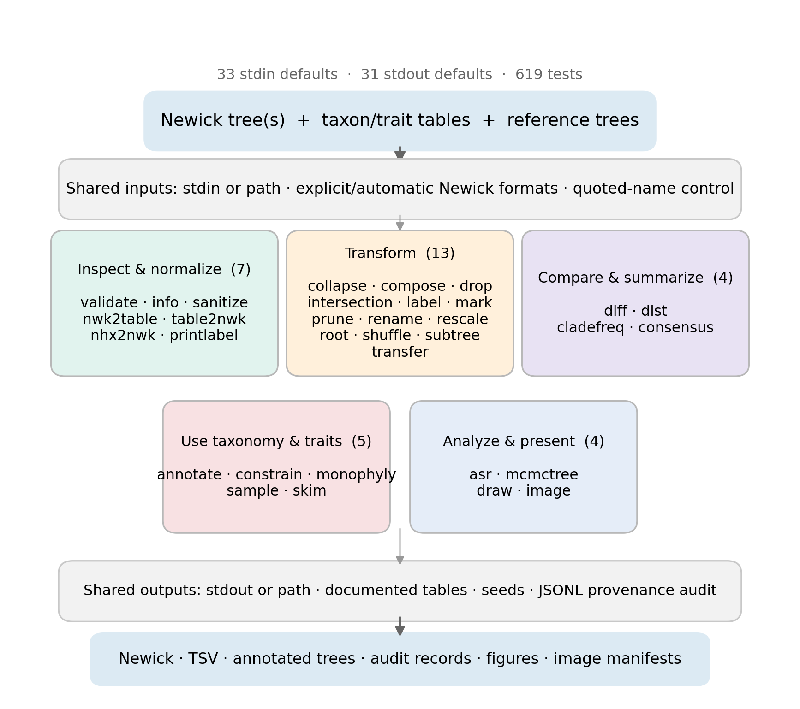
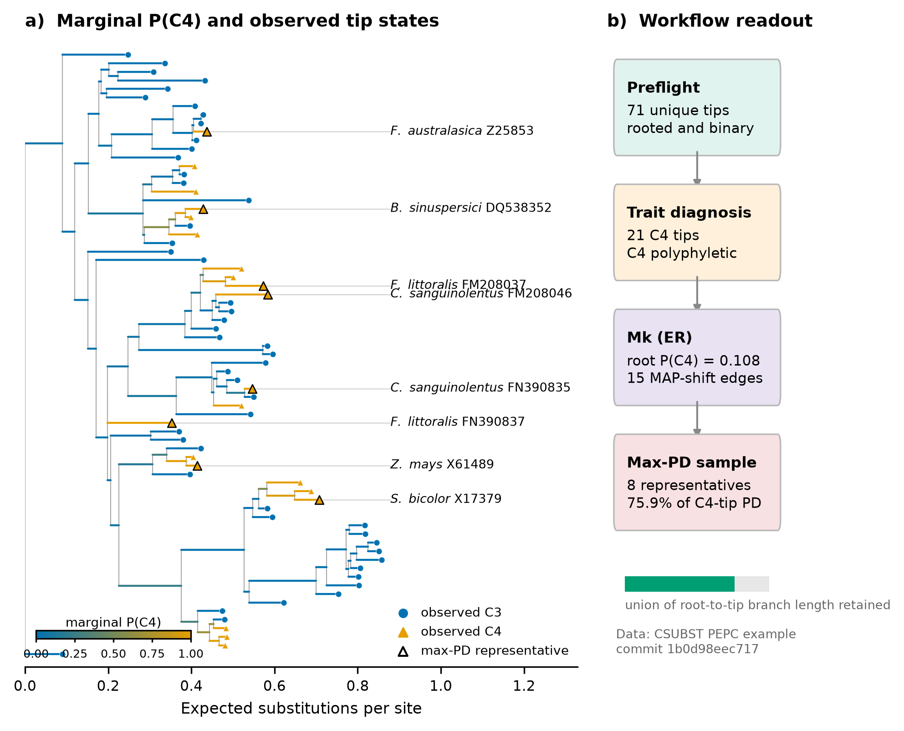
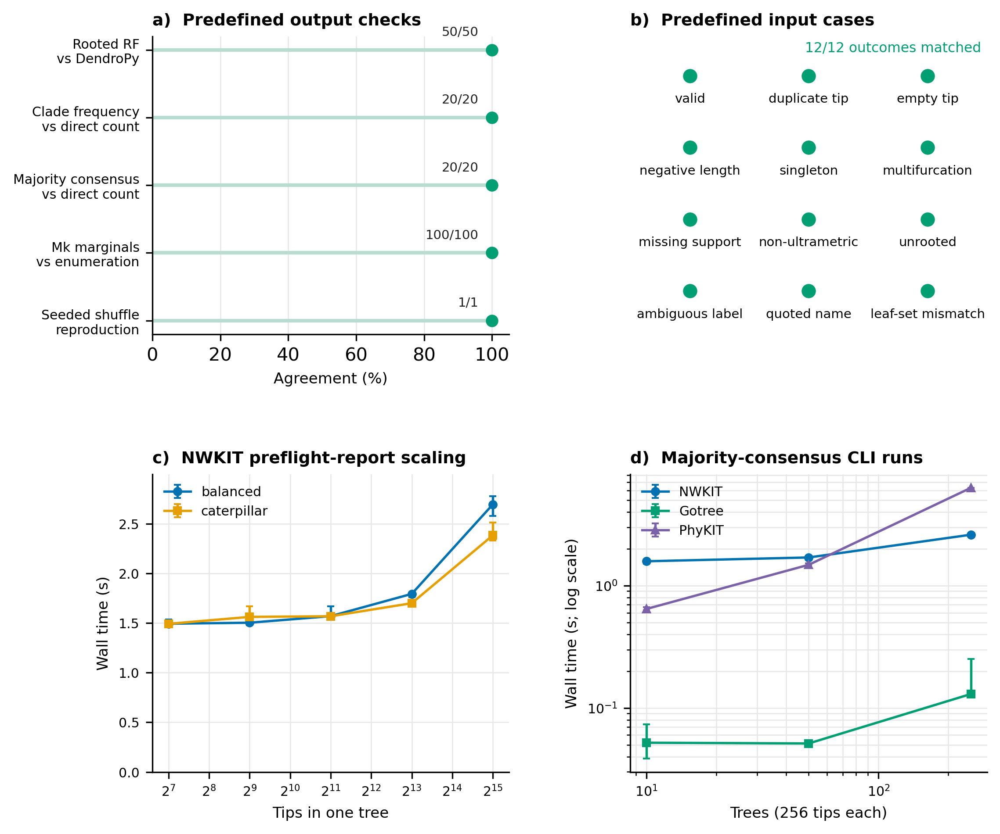

**Kenji Fukushima**^1,2^ (ORCID:
<https://orcid.org/0000-0002-2353-9274>)

^1^ Center for Frontier Research, National Institute of Genetics, Mishima,
Japan\
^2^ Genetics Program, Graduate Institute for Advanced Studies, SOKENDAI,
Mishima, Japan

Correspondence: **Kenji Fukushima**, National Institute of Genetics, 1111 Yata,
Mishima, Shizuoka 411-8540, Japan;
telephone: +81-55-981-6751; email: **kenji.fukushima@nig.ac.jp**

Author running head: **FUKUSHIMA**

Title running head: **COMPOSABLE TREE PROCESSING WITH NWKIT**

## Abstract

Phylogenetic trees commonly pass through several programs between inference and
biological interpretation. At these interfaces, investigators must reconcile
taxon sets, Newick conventions, annotations, rooting, metadata, and collections
of alternative topologies. Mature libraries and command-line toolkits address
many individual operations, but study-specific scripts remain common when the
operations must be combined. NWKIT is an open-source toolkit that exposes 30
tree-curation and analysis commands through a uniform Unix-style interface. All
commands accept their primary input from a file or standard input, and 28 return
their primary result to standard output, allowing tree operations to be joined
with each other and with other shell tools. NWKIT can inspect and sanitize
Newick, convert tree representations, prune and reroot trees, edit labels and
branch values, and transfer annotations by matching clades. It can also derive
taxonomic constraints, diagnose trait or species monophyly, compare and
summarize tree collections, sample taxa by phylogenetic diversity, reconstruct
categorical ancestral states under Mk models, prepare trees for downstream
programs, and create visualizations. Shared options make Newick interpretation,
quoted labels, species-label parsing, and stochastic seeds explicit across
commands. A worked analysis of a 71-tip angiosperm phosphoenolpyruvate
carboxylase tree composes preflight inspection, monophyly diagnosis,
ancestral-state reconstruction, and phylogenetic-diversity sampling without
intermediate custom scripts. NWKIT thereby provides an inspectable command-line
layer for replacing study-specific glue code with reproducible tree-processing
pipelines.

**Keywords:** ancestral-state reconstruction; command line; Newick;
phylogenetics; reproducibility; tree processing

Phylogenetic inference is rarely the final computational step in a systematic
study. Inferred trees may be passed to programs for reconciliation,
divergence-time estimation, comparative analysis, visualization, and reporting. Between
these stages, investigators routinely change taxon labels, remove or retain
leaves, reinterpret support values, reroot trees, transfer annotations between
related topologies, and summarize bootstrap or posterior tree collections. Each
operation can be simple in isolation. Their combination is harder to inspect
when it is encoded in a succession of manual edits, short scripts, and
software-specific conversions.

Newick is compact and broadly supported, but it leaves several conventions to
implementations. A numeric token following a closing parenthesis, for example,
may be interpreted as support or as an internal-node name. Rooting may be
represented only by the degree of the root, quoted labels may be accepted
inconsistently, and extended annotations differ among programs. Problems may
remain syntactically readable while changing biological interpretation. Empty
or duplicated tip labels, a negative branch length, or a mismatched taxon set
can likewise pass unnoticed until a later program fails or, more seriously,
produces an unintended result.

Several mature projects already provide phylogenetic tree representations and
algorithms. These include ape in R [@Paradis2004] and Bio.Phylo
[@Talevich2012], DendroPy [@Sukumaran2010; @Moreno2024], ETE
[@HuertaCepas2016], and TreeSwift [@Moshiri2020] in Python. Other projects expose
tree operations directly in the shell. Newick Utilities introduced automatable
filters for high-throughput Newick processing [@Junier2010]; Gotree provides
chainable commands and a Go application programming interface [@Lemoine2021];
and PhyKIT combines alignment, tree, and comparative functions for
phylogenomics [@Steenwyk2021]. The relevant need is consequently not another
generic tree object or a command-line interface alone. It is useful to ask
whether a consistent interface can combine defensive Newick handling,
topology-aware transformations, taxonomy-aware operations, tree-set synthesis,
and selected downstream analyses while remaining explicit about overlap with
existing tools.

NWKIT began in 2019 as a collection of Newick-processing commands. Version
0.27.0 expands this scope with preflight reporting and conversion, consensus and
clade-frequency calculation, taxonomy- and trait-aware selection, visualization,
and likelihood-based categorical ancestral-state reconstruction. Here, we
describe its design, audit task-level capabilities against three command-line
toolkits, and demonstrate an end-to-end biological workflow. We further compare
selected outputs with independent calculations, exercise a predefined corpus of
problematic inputs, and measure wall time and peak memory across tree shapes and
collection sizes. The objective is to delimit what the manuscript version does
and how it behaves, rather than to infer software quality from its command count.

## Materials and Methods

### Software Design and Implementation

Analyses used NWKIT 0.27.0 at source commit `f71dc345ac83`. NWKIT is implemented
in Python, requires Python 3.10 or later, and uses ETE 4.4.0 for its primary tree
representation. Biopython, NumPy, SciPy, pandas, and Matplotlib support sequence
input, numerical analysis, tabular output, and plotting. The source is
distributed under the MIT License.

The command-line interface contains 30 functional commands plus a help
pseudo-command. All 30 read their primary input from standard input by default and also
accept an explicit path. Twenty-eight write their primary result to standard
output by default; `draw` and `image` instead create graphical or image files.
Commands can therefore be joined by shell pipes when one command's tree output
is the next command's input. Stochastic operations in `asr`, `shuffle`, and
`skim` expose an integer seed.

Input handling separates syntax from biological interpretation. Users may
select an ETE Newick parser format, request automatic detection, or use a strict
automatic mode that rejects ambiguous unquoted numeric internal labels. A
separate option controls quoted node names. Shared species-label parsers support
genus--species prefixes, qualifier-aware labels, regular expressions, and
mapping tables. These choices are command options because silently guessing a
species or support convention can alter a downstream analysis.

### Functional Organization

Commands were grouped by user task (Fig. 1). Inspection and normalization cover
preflight reporting, summary information, label printing, sanitization, and
conversion between Newick, NHX, and a node table. Transformation commands
collapse, remove, fill, label, mark, prune, rename, rescale, reroot, shuffle,
extract, or transfer tree information. Tree-set operations calculate rooted
Robinson--Foulds (RF) distance [@RobinsonFoulds1981], clade frequencies, and
strict, majority, or greedy consensus trees. Taxonomy and trait operations
generate constraints, diagnose monophyly, select leaves greedily by phylogenetic
diversity [@Faith1992], or retain representatives within clades. Rooting can use
an outgroup, a second tree, the midpoint, minimal ancestor deviation
[@Tria2017], or reference taxonomies. Taxonomic sources include NCBI
[@Schoch2020], Open Tree of Life [@Hinchliff2015], and TimeTree
[@Kumar2022]; constraint generation can combine NCBI with APG IV
[@APG2016]. Downstream commands implement Mk-model categorical ancestral-state
reconstruction [@Lewis2001], prepare labelled trees for MCMCtree, draw annotated
trees, and retrieve taxon images subject to user-specified license filters.

### Software Tests and Release Checks

The pytest suite was executed in an isolated Python 3.12 environment containing
ETE 4.4.0 and Biopython 1.87. At the manuscript commit, 597 tests passed. The
suite includes exact-output examples, input and error cases, regression tests,
conversion round trips, seeded stochastic operations, threaded/single-process
agreement, and examples from the online documentation. The continuous-integration
matrix declares Python 3.10--3.14 and additionally runs static
checks, builds source and wheel distributions, inspects wheel contents, and
tests the installed wheel. Counts and command defaults were extracted from the
command registry by `paper/analysis/inventory.py` rather than transcribed from
the documentation. A separate process-level smoke test passed a tree through
`sanitize`, `rename`, and `rescale` using only standard input and output.

### Task-Level Software Comparison

The command-line comparison used NWKIT 0.27.0, Gotree 0.5.2, PhyKIT 2.3.0, and
Newick Utilities 1.6 as available on 16 July 2026. We reviewed current command
help, manuals, and source repositories and executed representative commands for
NWKIT, Gotree, and PhyKIT. Each row represented a user task, not a similarly
named function. “Native” required a directly documented command-line workflow;
“Partial” denoted a narrower or distributed implementation; and an em dash
means that an equivalent was not identified in the reviewed version. Absence
from the table is not evidence that an operation cannot be programmed with a
library or assembled from lower-level commands. General libraries were
discussed in the text but excluded from the main presence/absence table because
an API and a shell operation impose different workflow costs. The full decision
rules and evidence notes are retained in `capability_matrix.tsv`.

### Independent Output and Input-Case Checks

All checks used random seed 20260716. Rooted RF distances from NWKIT were
compared with DendroPy 5.0.10 for 50 pairs of random 16-tip binary trees sharing
a taxon namespace. Clade frequencies were checked in 20 collections, each
containing 25 random 12-tip trees, by independently enumerating descendant-tip
sets. Majority consensus was checked in 20 collections of 31 rooted 12-tip
trees against clades occurring in more than half of the input trees. Mk
marginal probabilities were checked in 100 random four-tip trees under a fixed
two-state equal-rates model. For this check, the comparison calculation
exhaustively enumerated every assignment of states to internal nodes instead of
using the pruning recursion implemented by NWKIT. Finally, `shuffle` was run in
separate processes with identical and different seeds and compared byte for
byte.

The predefined input corpus contained a valid control and cases with duplicated
or empty tips, a negative branch length, a singleton, a multifurcation, missing
support, non-ultrametric lengths, an unrooted topology, an ambiguous numeric
internal label, a quoted name, and mismatched leaf sets. The expected condition
was declared before execution. The check asked whether `validate` reported that
condition; it did not evaluate recovery or repair.

### Scaling and Cross-Tool Timing

Single-tree preflight scaling was measured for balanced and caterpillar trees
with 128, 512, 2,048, 8,192, or 32,768 tips. Each run requested a binary-tree
check. Majority-consensus timing used mixed collections of 10, 50, or 250 rooted
binary trees with 256 tips each. Equivalent CLI runs were made with NWKIT,
Gotree, and PhyKIT; definitions and output details are not identical, so the
measurements characterize operating costs rather than rank algorithmic speed.
Each condition was run three times. Wall time included process startup, and peak
resident memory was sampled every 5 ms for the process and its descendants.
Measurements were made on an x86-64 Mac with 12 physical CPU cores and 64 GB of
memory. All tools used one worker unless their default behavior required
otherwise.

### Worked Biological Example

The worked example used the phosphoenolpyruvate carboxylase (PEPC) tree and C4
photosynthesis foreground table distributed with CSUBST and associated with a
published convergence analysis [@Fukushima2023]. Files were retrieved from
CSUBST commit `1b0d98eec717` and verified against recorded SHA-256 checksums.
Regular-expression foreground definitions were expanded to one metadata row per
tip. The workflow checked the tree, diagnosed monophyly of C3 and C4 groups,
fitted a two-state equal-rates Mk model with an equal root prior, and greedily
selected eight C4 leaves that maximized the union of root-to-tip branch length.
The reported rooted-PD fraction was the selected root-to-tip branch union
divided by the union obtained when all C4 candidates were retained. Every
command and derived value is generated by
`worked_example.py`.

## Results

### One Interface Spans Five Tree-Processing Task Families

The 30 commands formed five practical groups: seven for inspection and
normalization, 12 for transformation, three for tree-set summaries, four for
taxonomy or trait operations, and four for downstream analysis or presentation
(Fig. 1). The categories share parser and label semantics, so a choice such as
strict automatic Newick interpretation is available across operations rather
than implemented separately in each workflow. Likewise, tree-producing commands
return Newick unless another output is requested. A curation sequence can
therefore be recorded as a shell pipeline rather than as intermediate files and
manual edits. Commands with secondary inputs, such as a reference tree or trait
table, still accept the primary tree through standard input. The three-command
stream smoke test removed a singleton, renamed all four tips, and doubled every
remaining branch length without an intermediate file.

{width=100%}

**Figure 1. Functional organization and shared interfaces in NWKIT 0.27.0.**
Command families describe user tasks and are not claims of algorithmic novelty.
All 30 functional commands read their primary input from standard input
(stdin) by default; 28 emit their primary result to standard output (stdout).
TSV denotes tab-separated values.

*Alt text:* A flow diagram passes Newick trees and metadata through shared input
rules to five shaded command-family boxes, then through shared output rules to
Newick, tables, and figures.

### Comparison Revealed Extensive Overlap and a Distinct Combination

All four reviewed toolkits provided routine transformation and visualization,
and three supported standard-stream composition directly (Table 1). Gotree and
PhyKIT both calculated consensus trees, and PhyKIT 2.3.0 provided a much broader
set of comparative, trait, network, and phylogenomic analyses than represented
by the selected rows. These overlaps argue against describing NWKIT as a
comprehensive replacement.

The audited differences instead concerned combinations and interface details.
NWKIT alone among the reviewed CLIs exposed an explicit strict mode for
ambiguous Newick interpretation and an integrated MCMCtree-calibration workflow.
Its rooting command combined outgroup and midpoint methods with minimal ancestor
deviation and taxonomy-derived roots. Gotree could download and prune NCBI
taxonomy, whereas NWKIT additionally mapped species-labelled tips to NCBI/APG,
OpenTree, or TimeTree workflows. NWKIT and PhyKIT both transferred annotations
by topology and implemented categorical ancestral-state workflows. The table
therefore positions NWKIT around preflight handling, shell composition, and the
co-occurrence of taxonomy, selection, tree-set, and dating-preparation tasks,
not around exclusive ownership of common algorithms.

**Table 1. Task-level capabilities in reviewed command-line toolkits.** Native
denotes a directly documented command-line workflow, Partial a narrower or
distributed implementation, and — that an equivalent was not identified in the
reviewed version. The rows describe operations used in the NWKIT workflows and
are not a general ranking; see Tables S2 and S3 for the complete matrix and
decision rules.

| User task | NWKIT 0.27.0 | Gotree 0.5.2 | PhyKIT 2.3.0 | Newick Utilities 1.6 |
|---|:---:|:---:|:---:|:---:|
| Standard-stream composition | Native | Native | Partial | Native |
| Explicit Newick interpretation and ambiguity rejection | Native | — | — | — |
| Consolidated preflight report | Native | Partial | Partial | Partial |
| Routine tree transformations | Native | Native | Native | Native |
| Rooting strategies | Native | Partial | Partial | Partial |
| Topology-aware annotation transfer | Native | Partial | Native | — |
| Tree-collection summaries | Native | Native | Native | Partial |
| Taxonomy-derived topology | Native | Partial | — | — |
| Trait-aware selection and monophyly | Native | Partial | Partial | — |
| Categorical ancestral-state analysis | Native | Partial | Native | — |
| MCMCtree calibration preparation | Native | — | — | — |
| Tree and trait visualization | Native | Native | Native | Native |

### A PEPC Workflow Connected Diagnosis, Inference, and Sampling

The pinned PEPC tree contained 71 unique tips and was rooted and binary.
Twenty-one tips were labelled C4. Neither the C4 nor C3 set was monophyletic: the MRCA
of C4-labelled tips contained 48 C3 intruders, consistent with repeated origins
and losses represented in this gene tree (Fig. 2). The fitted equal-rates Mk
model had an estimated transition rate of 3.633 per unit branch length. With an
equal root prior, the marginal probability of C4 at the root was 0.108. Fifteen
edges connected nodes with different maximum-a-posteriori states. This last
count is a descriptive summary of a single marginal reconstruction, not an
estimate of the number of evolutionary transitions.

Greedy maximum-PD selection retained eight of the 21 C4 tips and 75.9% of the
rooted PD represented by all C4 candidates. The selected accessions spanned C4
lineages in grasses, sedges, and eudicots. Importantly, the example did not establish the accuracy of
the PEPC tree or the C4 model. It showed that a versioned sequence of preflight,
trait diagnosis, reconstruction, sampling, and plotting operations could be
rerun without editing the tree between steps.

{width=100%}

**Figure 2. Worked C4-state analysis of the CSUBST phosphoenolpyruvate
carboxylase (PEPC) example.** a) Branch tone gives the NWKIT equal-rates Markov
k-state (Mk) marginal probability of C4; circles and triangles give observed C3
and C4 tip states, respectively. Black outlines identify the eight C4 tips
selected by greedy maximum phylogenetic diversity; labels give abbreviated
species names and sequence accessions. b) Outputs passed between the four
workflow stages. ER, equal rates; PD, phylogenetic diversity.

*Alt text:* A 71-tip rectangular tree has branches that vary along a marginal
C4-probability scale, with observed C3 tips shown as circles and C4 tips as
triangles. Eight C4 triangles are outlined and labelled by species and
accession. Four boxes summarize preflight, polyphyly, Mk reconstruction, and
retention of 75.9% of C4-tip rooted phylogenetic diversity.

### Output Checks and Scaling Delimited the Tested Range

NWKIT matched the comparison result in all 191 predefined output checks (Fig.
3a). Rooted RF distance agreed exactly for 50 tree pairs. Clade sets and
frequencies agreed for all 20 tree collections, as did majority-consensus clades
for another 20 collections. Across 100 Mk checks, the largest absolute
difference from exhaustive enumeration was 2.22 × 10^-16^. Repeated seeded
shuffling produced identical output, whereas the second seed changed the
output. The preflight report identified the declared condition in all 11
problem cases and reported no issue for the valid control (Fig. 3b).

All 30 single-tree preflight runs and all 27 consensus runs completed
successfully. Median preflight time rose
from 1.49 s at 128 tips to 2.69 s for the 32,768-tip balanced tree and 2.38 s for
the caterpillar tree; corresponding peak memory was 261 and 267 MB (Fig. 3c).
The approximately 1.5-s lower bound largely reflected Python process and module
startup on this machine.

For 250 trees of 256 tips, median majority-consensus time was 2.60 s for NWKIT,
0.130 s for Gotree, and 6.29 s for PhyKIT; peak resident memory was 158, 21, and
82 MB, respectively (Fig. 3d). Gotree was also the fastest at 10 and 50 trees.
These results show that NWKIT handled the tested collection sizes, but they do
not support a general performance advantage. Process startup, language runtime,
consensus details, and input structure all contribute to the observed values.

{width=100%}

**Figure 3. Independent output checks, predefined input cases, and scaling.**
a) Agreement counts for rooted Robinson--Foulds (RF) distance, clade frequency,
consensus, Markov k-state (Mk) marginal probabilities, and seed reproduction.
b) Expected outcomes for the valid control and 11 declared problem conditions.
c) Median wall time and range across three NWKIT preflight runs per tree size
and shape; the horizontal axis is logarithmic. d) Median wall time and range
for three majority-consensus command-line interface (CLI) runs; both axes are
logarithmic.

*Alt text:* Two upper panels show 100% agreement and 12 matched-outcome case
markers. Lower panels show modest growth in NWKIT preflight time to 32,768 tips
and differing consensus-time curves for NWKIT, Gotree, and PhyKIT.

## Discussion

NWKIT integrates several kinds of downstream tree work behind common,
pipe-compatible conventions. Its contribution is not its command count, but
the way explicit input rules connect preflight reporting, transformations,
taxonomic references, tree collections, trait analysis, sampling, and
preparation for downstream programs. This arrangement keeps commands and
intermediate meanings visible in a sequence of defined operations.

The comparison also identifies preferable alternatives. Gotree was
substantially faster in the present consensus runs. PhyKIT includes many
alignment, comparative, network, and phylogenomic analyses without NWKIT
counterparts. ETE, DendroPy, Bio.Phylo, TreeSwift, and ape remain appropriate
for new algorithms, custom data models, and programmatic control; NWKIT depends
on ETE and scientific Python rather than replacing them.

Several limitations follow. NWKIT is Newick-centered rather than a general
container for characters, alignments, and trees. Automatic detection cannot
remove ambiguity from unannotated text; strict mode can reject ambiguity but
cannot infer authorial intent, and structural rootedness still requires
biological confirmation. Taxonomy, divergence-time, and image commands depend
on external services, while image retrieval requires license and attribution
checks. Finally, its categorical ER, symmetric, and all-rates-different Mk
models and stochastic maps do not replace broader comparative modeling.

The evaluation is deliberately bounded. The capability table was constructed
from selected NWKIT workflows, so it should not be read as an exhaustive census
of competing software. “Not identified” is weaker than proof of absence. Output
checks covered defined semantics on small random trees, and the scaling analysis
used one x86-64 Mac, synthetic inputs, and three repetitions. The 12 input cases
demonstrate reporting behavior for those cases only. They do not justify an
unqualified description of the software as validated or error-proof.

These boundaries suggest practical future work: preserve the command inventory
and comparison rubric as executable release metadata, add cross-platform
benchmark runs, archive real workflow data, and expand independent checks when
new analytical commands are added. The formal commitment to at least two years
of maintenance and user support required by the target article type must be
confirmed in the submission. With those release practices, NWKIT can serve as a
transparent command-line layer between tree inference and specialized
downstream analyses while continuing to coexist with
the libraries and toolkits on which phylogenetic workflows depend.

## Acknowledgments

OpenAI Codex was used to assist with manuscript drafting, analysis-code
development, document formatting, and consistency checks. The author reviewed
and verified the material and accepts responsibility for the work.

## Funding

This work was supported by the Sofja Kovalevskaja Programme of the Alexander
von Humboldt Foundation, Human Frontier Science Program grant RGY0082/2021,
and JSPS KAKENHI JP23K20050.

## Author Contributions

Kenji Fukushima conceptualized the study, developed NWKIT, performed the
analyses, and wrote and revised the manuscript.

## Conflict of Interest

The author declares no conflict of interest.

## Data Availability

NWKIT source code is available at <https://github.com/kfuku52/nwkit>. A
versioned source and analysis snapshot will be archived in Zenodo. Comparison
records, results, benchmarks, worked-example inputs, and reproduction
instructions will be deposited in Dryad; identifiers will be added before
submission. The PEPC inputs are also available in the CSUBST repository at the
commit and checksums reported above.

## References
